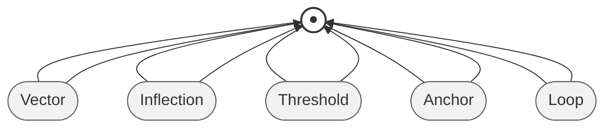

# **VITAL‑MASTER‑MAP**  
*A conceptual graph of meaning, movement, and emotional architecture*

The **VITAL‑MASTER‑MAP** project is a structured, evolving representation of how meaning flows through a human life — how vectors initiate movement, how inflection points shift direction, how thresholds activate sensitivity, how anchors stabilize experience, and how loops reinforce patterns over time.


This repository serves as both a **conceptual model** and a **graph‑based map** of the V.I.T.A.L. framework, integrating personal, relational, conceptual, and metaphoric domains into a single coherent system.

---

## **Purpose**
The goal of VITAL‑MASTER‑MAP is to create a **living semantic graph** that captures:

- how meaning is constructed and revealed  
- how relationships catalyze emotional movement  
- how metaphors shape interpretation  
- how purpose emerges from meaning  
- how internal states interact with external contexts  

It is both a **thinking tool** and a **mapping tool**, designed to help visualize the architecture of experience.

---

## **Core Components**
The project is built around the five V.I.T.A.L. elements:

### **Vector**  
Initiation, direction, intensity, and movement.

### **Inflection Point**  
Emotional and cognitive shifts that redirect the system.

### **Threshold**  
Activation points where sensitivity, uncertainty, or readiness changes.

### **Anchor**  
Stabilizing forces that ground experience.

### **Loop**  
Recurring patterns that reinforce or reshape meaning.

These components form the backbone of the conceptual model and appear throughout diagrams, CSV tables, and relational mappings.

---

## **Project Structure**

```
vital-master-map/
│
├── data/
│   ├── nodes.csv
│   └── edges.csv
│
├── diagrams/
│   ├── vital-class-diagram.md
│   ├── vital-mindmap.md
│   ├── vital-flowchart.md
│   └── vital-er-diagram.md
│
├── notes/
│   └── journal.md
│
└── README.md
```

### **data/**
Contains the graph data used for visualization and analysis.

- **nodes.csv** — entities in the system  
- **edges.csv** — relationships between entities  

### **diagrams/**
Mermaid diagrams that visualize the conceptual architecture.

### **notes/**
Reflective writing, conceptual development, and narrative context.

---

## **Node Schema**
Each node represents an entity in the conceptual world and follows this schema:

- **Id** — unique identifier  
- **Label** — human-readable name  
- **Type** — class of entity (Person, Concept, Metaphor, Context, System, State, Event)  
- **Role** — functional behavior within the system  
- **Domain** — realm the node belongs to (Personal, Relational, Conceptual, Metaphoric, Systemic, Emotional, Narrative)

Nodes are added only when they introduce a distinct identity or conceptual dimension.

---

## **Edge Schema**
Edges represent relationships and flows between nodes:

- **Source** — initiator  
- **Target** — receiver  
- **Relation** — verb describing the interaction  
- **Direction** — Directed or Bidirectional  

Edges are added only when the relationship expresses meaningful flow, grounding, influence, or transformation.

---

## **Conceptual Philosophy**
VITAL‑MASTER‑MAP is built on four principles:

### **Hope**  
Every node and relationship should preserve possibility.

### **Agency**  
The system must reflect choice, movement, and intentionality.

### **Honesty**  
Nodes and edges must accurately represent lived experience.

### **Dignity**  
The architecture must respect the emotional truth of the system.

These principles ensure the map remains aligned with the meaning it is designed to express.

---

## **Tools & Workflow**
The project is developed using:

- **VS Code** for editing, documentation, and diagram rendering  
- **Mermaid** for conceptual visualization  
- **CSV tools** for node/edge management  
- **Gephi** for graph layout and analysis  

VS Code serves as the *thinking studio*, while Gephi serves as the *visual engine*.

---

## **Future Development**
Planned expansions include:

- emotional state nodes  
- narrative event nodes  
- entanglement‑like relational structures  
- multi‑layer diagrams integrating personal anchors  
- ontology refinement for Types, Roles, and Domains  

The project is intentionally open‑ended — a map that grows as meaning grows.

---

# **VITAL‑MASTER‑MAP — Logo Description**

The **VITAL‑MASTER‑MAP** logo is a minimalist geometric emblem built around the five components of the V.I.T.A.L. framework. It is designed to feel both conceptual and grounded, reflecting the project’s purpose: mapping the architecture of meaning, movement, and emotional flow.

### **Core Shape**
A circular form divided into **five interlocking segments**, each representing one V.I.T.A.L. element:

- **Vector** — a forward‑leaning arrow segment  
- **Inflection Point** — a curved bend or pivot  
- **Threshold** — a vertical bar or gate  
- **Anchor** — a downward stabilizing triangle  
- **Loop** — a circular arc completing the cycle  

Together, these shapes form a continuous ring, symbolizing the cyclical nature of meaning and emotional movement.

### **Center Symbol**
At the center of the circle sits a small, open dot — representing:

- awareness  
- presence  
- the self as observer  
- the origin point of meaning  

It is intentionally unfilled to symbolize openness and possibility.

### **Color Palette**
A muted, conceptual palette:

- **Deep Slate Blue** — stability (Anchor)  
- **Soft Gold** — meaning and purpose (Threshold)  
- **Warm Coral** — emotional movement (Inflection Point)  
- **Teal Green** — renewal and flow (Loop)  
- **Neutral Gray** — direction and clarity (Vector)  

The colors are subtle, chosen to evoke emotional nuance rather than intensity.

### **Typography**
The project name appears below the emblem in a clean, modern typeface:

**VITAL‑MASTER‑MAP**  
*Mapping the architecture of meaning*

Typography is intentionally understated to keep the symbol as the focal point.

### **Overall Feel**
The logo is:

- **conceptual** without being abstract  
- **structured** without being rigid  
- **emotional** without being sentimental  
- **philosophical** without being opaque  

It visually communicates the project’s essence: a system where meaning flows, shifts, stabilizes, and returns — always in motion, always connected.

---

# **Mermaid Logo Sketch — VITAL‑MASTER‑MAP**



---


# **How to read this sketch**

### **● Center Dot**
Represents:
- awareness  
- presence  
- origin of meaning  
- the self as observer  

### **Five Surrounding Segments**
Each segment is placed around the center, forming a conceptual ring:

- **Vector** — forward movement  
- **Inflection** — directional shift  
- **Threshold** — activation point  
- **Anchor** — grounding  
- **Loop** — recurrence  

The arrows point inward to show that each component feeds into the center of meaning.

### **Minimalist Geometry**
The sketch uses:
- a central node  
- five surrounding nodes  
- equal spacing  
- simple strokes and fills  

It’s intentionally abstract — a conceptual emblem rather than a literal graphic.

