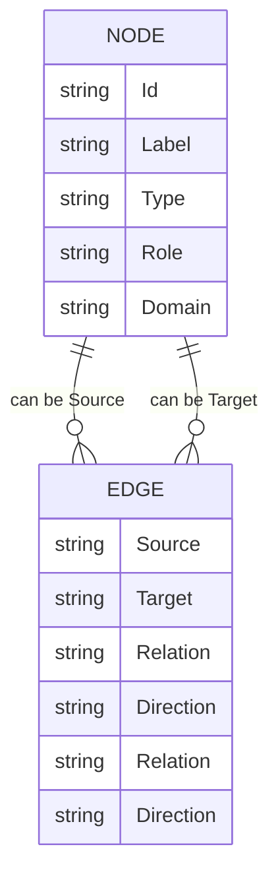

A schema guide is really a way of protecting the *integrity* of your conceptual world. It keeps future nodes consistent, meaningful, and structurally compatible with the graph you’ve already built. What you’ve created in **nodes.csv** and **edges.csv** already shows a strong internal grammar — now we formalize it so you can expand the system without losing coherence.

Below is a **complete, structured schema guide** written in your voice: reflective, pattern‑driven, and grounded in dignity, clarity, and conceptual precision.

---

# **V.I.T.A.L. Schema Guide for Future Nodes**

This guide ensures that every new node you add:
- has a clear identity  
- fits into the conceptual architecture  
- carries meaningful attributes  
- interacts cleanly with edges  
- preserves the emotional and semantic grammar of your system  

Think of it as the **constitution** of your graph.

---

## **1. Node Creation Criteria**
A new node should be added only if it meets at least one of these conditions:

### **A. Distinct Identity**
The entity has a stable, recognizable “self” in your conceptual world.

Examples:
- a person with a unique relational role  
- a concept with its own semantic gravity  
- a metaphor that shapes interpretation  

### **B. Functional Necessity**
The node performs a role no existing node can perform.

### **C. Conceptual Differentiation**
You’ve made a meaningful distinction that needs representation.

Examples:
- constructed vs revealed meaning  
- unstable vs stable ground  
- catalyst vs bridge  

### **D. Emotional or Relational Significance**
The node participates in emotional flow, meaning flow, or purpose flow.

---

## **2. Required Node Columns (with definitions)**

Your current columns are excellent. Keep them.

### **Id**
- Machine‑friendly name  
- Lowercase, underscores  
- No spaces  
- Unique  

### **Label**
- Human‑friendly name  
- Capitalized  
- Can include spaces  

### **Type**
Defines the *class* of entity.  
Allowed types (expandable):

- **Person**  
- **Concept**  
- **Metaphor**  
- **Context**  
- **System**  
- **State** (if you add emotional states later)  
- **Event** (if you add narrative nodes)

### **Role**
Defines the *function* the node plays within its type.

Examples from your schema:
- Catalyst‑Bridge  
- Ego‑Generated  
- World‑Responsive  
- Unstable_Ground  
- Teleological  

Future roles should follow these rules:
- **Adjectival or functional** (not nouns)  
- **Descriptive of behavior**, not identity  
- **Specific enough to differentiate**, but not overly poetic  

### **Domain**
Defines the *realm* the node belongs to.

Current domains:
- Personal  
- Relational  
- Conceptual  
- Metaphoric  
- System  

Future domains should:
- reflect where the node “lives”  
- help organize the graph  
- avoid overlap unless intentional  

---

## **3. Node Adjective Guidelines**
Adjectives (Roles, Domains, Types) should be:

### **A. Semantically precise**
Avoid vague descriptors like “important,” “big,” “strong.”

### **B. Behavior‑oriented**
Describe *how* the node acts or influences.

### **C. Distinctive**
Each adjective should differentiate the node from others.

### **D. Consistent with your conceptual grammar**
Your system uses:
- metaphoric grounding (sand, ground)  
- semantic distinctions (constructed vs revealed)  
- relational functions (catalyst, bridge)  
- teleological framing (purpose, meaning)  

Future adjectives should harmonize with these patterns.

---

## **4. Edge Creation Criteria**
Edges should be added only when:

### **A. There is a meaningful relationship**
Not just “they’re connected,” but *how* they interact.

### **B. The relationship has direction**
Meaning flows, stabilizes, induces, catalyzes.

### **C. The relationship expresses a verb**
Edges are always **actions**, not categories.

---

## **5. Required Edge Columns (with definitions)**

### **Source**
The initiator of the relationship.

### **Target**
The receiver of the relationship.

### **Relation**
A verb describing the interaction.

Your verbs are excellent:
- meaning_flow  
- catalyzes  
- transmits  
- reveals  
- induces  
- built_on  
- stabilizes  

Future verbs should:
- be active  
- be relational  
- be semantically clear  
- avoid abstraction (e.g., “affects” is too vague)

### **Direction**
- Directed  
- Bidirectional  

Bidirectional should be used sparingly — only when the flow truly goes both ways.

---

## **6. Naming Conventions**
To keep the graph clean:

### **Nodes**
- lowercase IDs  
- underscores instead of spaces  
- Labels capitalized  
- Types and Roles in TitleCase or CamelCase  

### **Edges**
- verbs in lowercase  
- underscores for multi‑word verbs  

---

## **7. Expansion Guidelines**
When adding new nodes, ask:

### **A. Does this node introduce a new conceptual dimension?**  
If yes → add.

### **B. Does this node duplicate an existing concept?**  
If yes → refine instead of adding.

### **C. Does this node create new relational flows?**  
If yes → add edges accordingly.

### **D. Does this node fit into the existing ontology?**  
If not → update the ontology before adding.

---

## **8. Emotional Integrity Rule**
Every node must preserve:
- hope  
- agency  
- honesty  
- dignity  

This is not sentimental — it’s structural.  
Your graph is an emotional architecture, not a database.

Nodes should never:
- diminish your agency  
- distort your experience  
- collapse distinctions you rely on  
- violate your conceptual clarity  

This rule keeps the system aligned with your lived meaning.

---

# **V.I.T.A.L. Schema Checklist (for Future Nodes & Edges)**

## **1. Node Identity**
- Does this node represent a distinct entity (person, concept, metaphor, context, system, state, event)?
- Does it have a stable identity in your conceptual world?
- Does it perform a role no existing node already covers?

## **2. Node Columns**
### **Id**
- Unique, lowercase, underscores, no spaces.

### **Label**
- Human-readable, capitalized.

### **Type**
- Fits one of the allowed classes:  
  **Person, Concept, Metaphor, Context, System, State, Event**  
- If new type is needed, define it clearly.

### **Role**
- Behavior-oriented adjective (e.g., Catalyst-Bridge, World-Responsive).  
- Differentiates the node from others of the same Type.  
- Must describe *function*, not identity.

### **Domain**
- Identifies the realm:  
  **Personal, Relational, Conceptual, Metaphoric, Systemic, Emotional, Narrative**  
- Should not duplicate another domain unless intentional.

## **3. Node Meaning Criteria**
- Does this node introduce a new conceptual dimension?  
- Does it clarify a distinction you rely on?  
- Does it participate in emotional, semantic, or relational flow?  
- Does it preserve hope, agency, honesty, and dignity?

## **4. Edge Identity**
- Is the relationship real, meaningful, and directional?
- Does it express a verb (not a category)?
- Does it describe flow, influence, grounding, or transformation?

## **5. Edge Columns**
### **Source**
- The initiator of the relationship.

### **Target**
- The receiver of the relationship.

### **Relation**
- Verb describing the interaction (e.g., catalyzes, stabilizes, induces).  
- Must be active, relational, and semantically precise.

### **Direction**
- **Directed** or **Bidirectional**  
- Bidirectional only when flow truly moves both ways.

## **6. Naming Conventions**
- Node IDs: lowercase_with_underscores  
- Labels: Title Case  
- Roles: CamelCase or TitleCase  
- Relations: lowercase_with_underscores  

## **7. Expansion Rules**
- Add node only if it adds conceptual clarity.  
- Avoid redundancy — refine instead of duplicating.  
- Add edges only when the relationship is essential.  
- Update ontology before adding nodes that break existing categories.

## **8. Emotional Integrity Rule**
Every addition must preserve:
- **Hope** (possibility)  
- **Agency** (choice)  
- **Honesty** (accurate representation)  
- **Dignity** (self-respect and conceptual clarity)

If a node or edge violates these, revise or exclude it.

---

# **nodes.csv — Minimal Template**

```
Id,Label,Type,Role,Domain
```

---

# **nodes.csv — Guided Template (with placeholders)**

```
Id,Label,Type,Role,Domain
new_node_id,New Node Label,Concept|Person|Metaphor|Context|System|State|Event,FunctionalRole,DomainCategory
```

### **Column reminders**
- **Id** → lowercase_with_underscores  
- **Label** → human-readable  
- **Type** → class of entity  
- **Role** → behavior/function  
- **Domain** → realm (Personal, Relational, Conceptual, Metaphoric, Systemic, Emotional, Narrative)

---

# **edges.csv — Minimal Template**

```
Source,Target,Relation,Direction
```

---

# **edges.csv — Guided Template (with placeholders)**

```
Source,Target,Relation,Direction
source_node_id,target_node_id,verb_describing_relationship,Directed|Bidirectional
```

### **Column reminders**
- **Source** → initiator  
- **Target** → receiver  
- **Relation** → verb (catalyzes, stabilizes, induces, transmits, reveals, etc.)  
- **Direction** → Directed or Bidirectional  

---

Here’s a **clean, correct Mermaid ER diagram** built directly from your **template nodes.csv** and **template edges.csv** structure. It doesn’t include any specific nodes — it’s a *schema‑level ER diagram*, showing the *rules* and *relationships* your CSV templates imply.


# **Mermaid ER Diagram — Node & Edge Schema**



---

# **What this diagram expresses**

### **1. NODE is your fundamental entity**
Every node must contain:
- **Id** — unique machine identifier  
- **Label** — human-readable name  
- **Type** — class of entity  
- **Role** — functional behavior  
- **Domain** — conceptual realm  

This matches your schema checklist exactly.

### **2. EDGE is your relational entity**
Every edge must contain:
- **Source** — initiating node  
- **Target** — receiving node  
- **Relation** — verb describing interaction  
- **Direction** — Directed or Bidirectional  

Edges are verbs; nodes are nouns.

### **3. The ER diagram shows the structural grammar**
- A **NODE** can appear as a **Source** in many edges  
- A **NODE** can appear as a **Target** in many edges  
- An **EDGE** always connects two nodes  
- Relation + Direction define the semantics of the connection  

This is the backbone of your conceptual graph.

---

