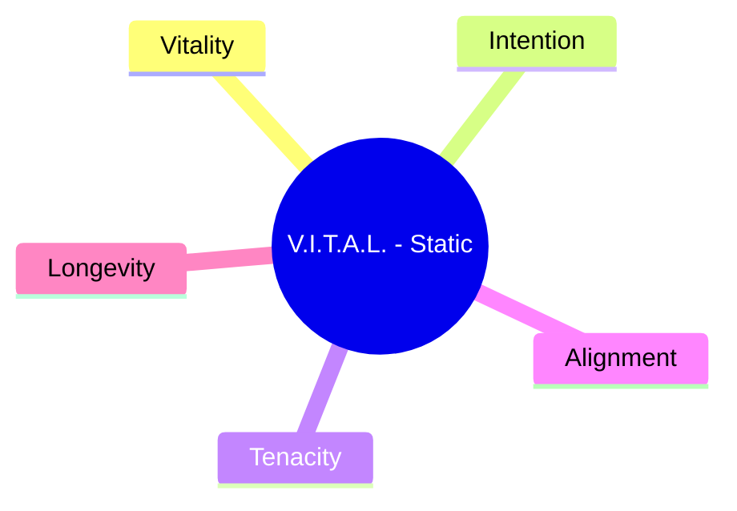
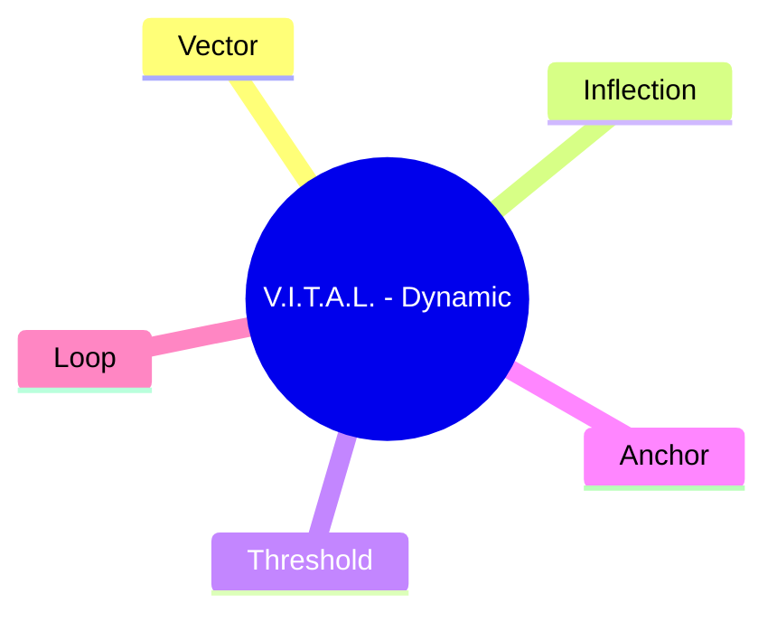
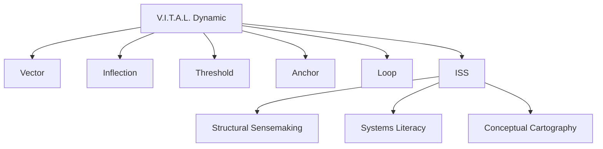
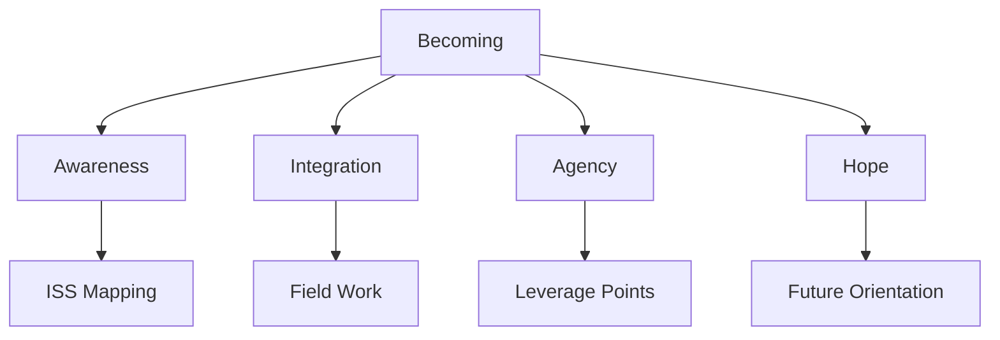
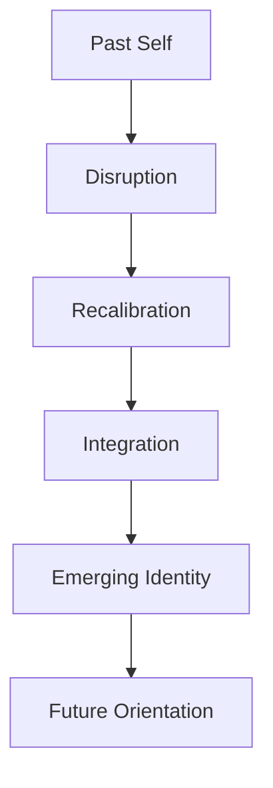
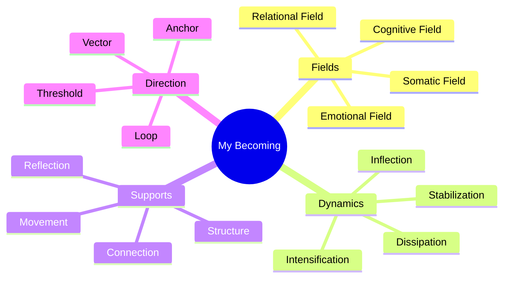
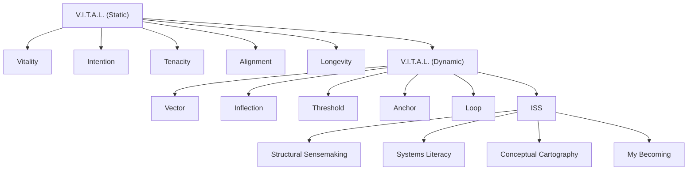
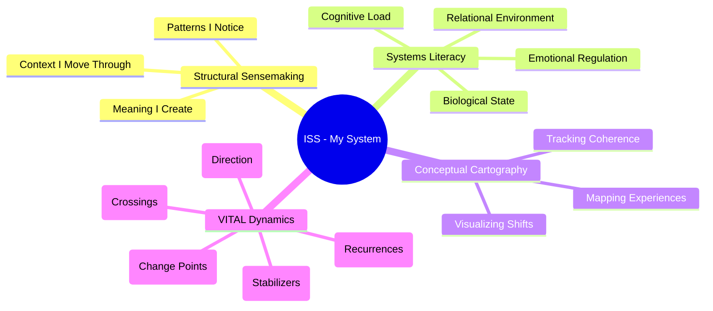
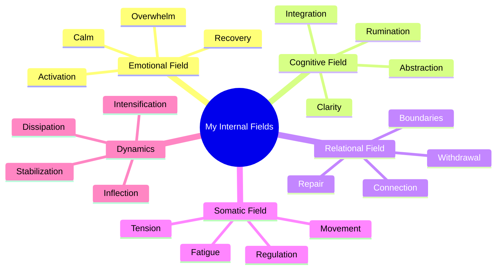
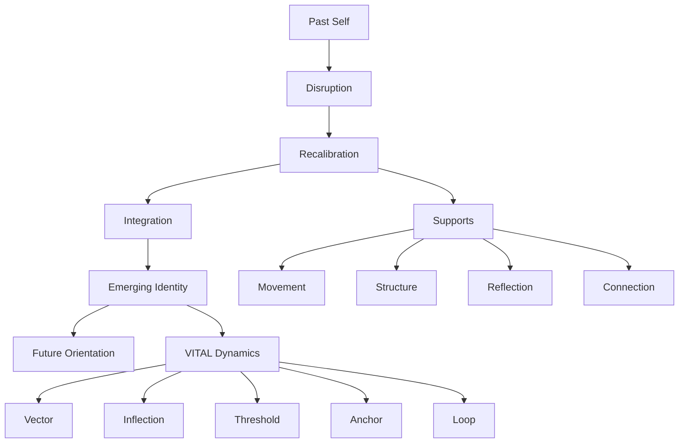

# **Integrative Structural Sensemaking (ISS): An Introduction for Therapy**

## **Why I Created ISS**
ISS is my personal framework for understanding how I change, how I stabilize, and how I grow. It helps me organize my internal experience, track patterns, and stay oriented during transitions. It’s not a clinical model — it’s a *self‑leadership tool* that gives me structure, clarity, and agency.

ISS emerged directly from the evolution of my earlier framework, **V.I.T.A.L.**

---

# **How V.I.T.A.L. Evolved Into ISS**

## **1. The Original V.I.T.A.L. (Static Model)**  
When I first created V.I.T.A.L., it was a **static identity framework**:

- **Vitality** — energy and presence  
- **Intention** — direction and purpose  
- **Tenacity** — perseverance  
- **Alignment** — coherence  
- **Longevity** — sustainability  

It helped me articulate *who I was* and *what mattered*, but it didn’t yet capture movement, change, or the dynamics of becoming.

---

## **2. The Shift: Movement Enters the Map**
When I began mapping my internal experience visually, I realized identity isn’t static — it moves, bends, loops, and shifts. So V.I.T.A.L. evolved into a **dynamic system**:

- **Vector** — direction of movement  
- **Inflection** — points of change  
- **Threshold** — crossings or transitions  
- **Anchor** — stabilizing forces  
- **Loop** — recurring patterns  

This version of V.I.T.A.L. finally matched the reality of my lived experience: identity is not a fixed object; it’s a moving system.

---

## **3. ISS Emerges**
Once V.I.T.A.L. became dynamic, I needed a way to:

- map the movement  
- understand the structure  
- track the shifts  
- integrate the patterns  
- make sense of the fields I move through  

That’s where **Integrative Structural Sensemaking (ISS)** came from.

ISS is the *structural, diagrammatic, systems‑based extension* of V.I.T.A.L.

Where V.I.T.A.L. gives me **language**,  
ISS gives me **architecture**.

---

# **How ISS Helps Me in Therapy**

ISS helps me:

- understand my internal “fields” (emotional, relational, cognitive)  
- see how shifts happen (inflection points, thresholds)  
- identify stabilizers (anchors)  
- recognize loops without shame  
- track direction (vectors)  
- build agency by identifying leverage points  
- stay oriented during transitions  
- integrate past experiences without being defined by them  

ISS is how I manage my **becoming** — the ongoing process of shaping a grounded, intentional identity.

---

## These diagrams help visually explain the evolution.

---

## **Original V.I.T.A.L. (Static)**

---

## **Dynamic V.I.T.A.L. (Movement-Based)**

---

## **How Dynamic V.I.T.A.L. Leads to ISS**

---

## **ISS as a Tool for Becoming**

---

# **The “Becoming Arc” (Identity Over Time)**  
This shows my movement from past → present → emerging future.

---

# **The “Internal Field Map” (ISS Applied to Me)**  
This shows how ISS helps me organize my internal landscape.

---

# **The “V.I.T.A.L. → ISS → Becoming” Integration Map**  
This shows the evolution of my frameworks and how they support my identity work.

---

# **My Personal ISS Map (Core Architecture)**

This shows how ISS functions inside *my* system — not abstractly, but as my lived structure.

---

# **My Internal Fields Map (ISS Applied to Me)**

This shows the “terrain” I move through — the fields that shape my experience.

---

# **My Becoming Map (Identity in Motion)**

This is the heart of my work — the movement from disruption → recalibration → integration → emergence.

