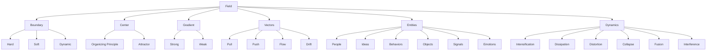
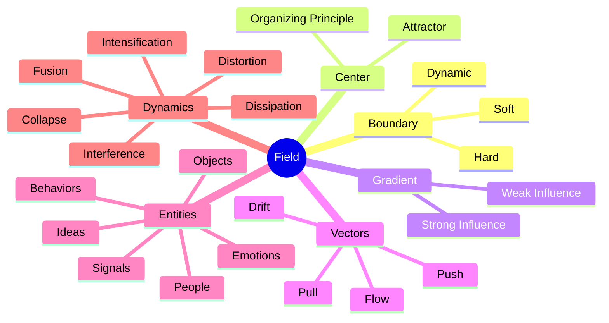
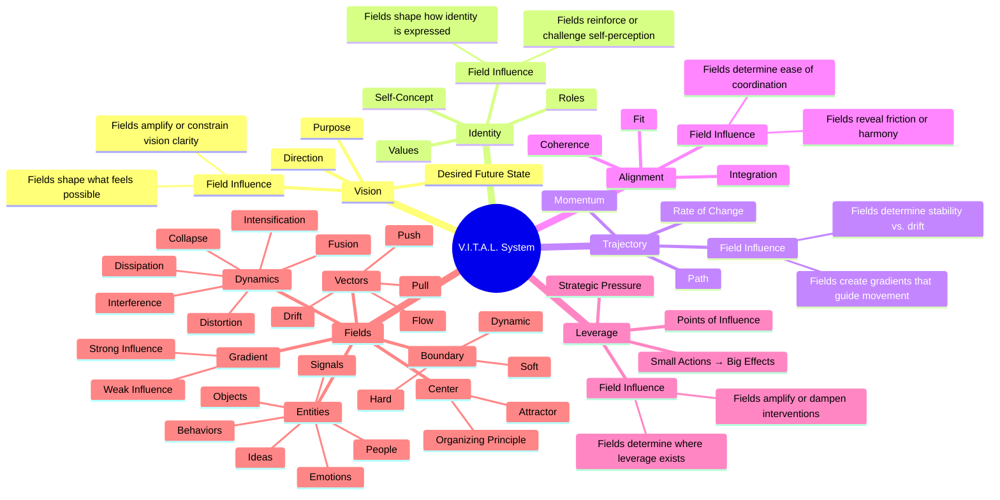

# **Proposed Hybrid Name**
## **Integrative Structural Sensemaking (ISS)**  
A synthesis of **Structural Sensemaking**, **Integrative Systems Literacy**, and **Applied Conceptual Cartography**.

This hybrid name signals three things at once:

- **Integrative** — the field unifies insights across domains.  
- **Structural** — it focuses on underlying patterns, architectures, and relationships.  
- **Sensemaking** — its purpose is to improve human understanding and decision‑making.

It’s broad enough to encompass your V.I.T.A.L. work, diagramming, modeling, and conceptual architecture design — yet specific enough to feel like a discipline.

---

# **Formal Definition of the Field**

## **Field Name:** *Integrative Structural Sensemaking (ISS)*  
## **Short Definition:**  
Integrative Structural Sensemaking is the discipline of revealing, modeling, and applying the underlying structures that shape complex domains, enabling clearer thinking, better decisions, and more coherent communication.

---

## **Mission Statement**  
To enhance human understanding by uncovering hidden patterns, integrating disparate knowledge, and constructing conceptual architectures that make complexity navigable.

---

## **Scope of the Field**  
ISS operates at the intersection of:

- **Systems thinking**  
- **Cognitive modeling**  
- **Diagrammatic reasoning**  
- **Framework design**  
- **Interdisciplinary synthesis**  
- **Pattern discovery and interpretation**

It is both analytical (revealing structure) and generative (creating new conceptual pathways).

---

## **Core Objectives**

### **1. Reveal Hidden Structure**  
Identify the patterns, relationships, and organizing principles that govern complex systems.

### **2. Build Coherent Conceptual Models**  
Translate complexity into diagrams, schemas, frameworks, and maps that preserve nuance while increasing clarity.

### **3. Integrate Knowledge Across Domains**  
Bridge insights from multiple fields to create unified conceptual architectures.

### **4. Improve Human Reasoning & Communication**  
Provide tools that help individuals and teams think more clearly, collaborate more effectively, and make better decisions.

### **5. Enable Structural Creativity**  
Use models to generate new ideas, hypotheses, and strategic options.

### **6. Standardize Modeling Practices**  
Define shared methods, notation, workflows, and quality standards for structural modeling.

### **7. Train Practitioners**  
Develop skill ladders, competency frameworks, and onboarding pathways for newcomers.

---

## **Subfields**

### **1. Conceptual Cartography**  
Mapping conceptual terrain to reveal relationships and boundaries.

### **2. Structural Modeling**  
Building diagrams, schemas, and frameworks that represent underlying architectures.

### **3. Systems Integration**  
Synthesizing insights across disciplines to form unified models.

### **4. Cognitive Architecture Design**  
Creating mental models and frameworks that support reasoning and decision‑making.

### **5. Pattern Analysis & Interpretation**  
Identifying recurring structures across domains and applying them to new contexts.

---

## **Practitioner Roles**

- **Structural Modeler** — builds diagrams, schemas, and frameworks.  
- **Concept Cartographer** — maps conceptual landscapes.  
- **Systems Integrator** — unifies insights across fields.  
- **Framework Designer** — creates reusable mental models.  
- **Pattern Analyst** — identifies and interprets structural patterns.  
- **Sensemaking Facilitator** — guides teams through complex reasoning.

---

## **Methods & Tools**

- Diagramming (Mermaid, VS Code, Gephi)  
- Structural mapping  
- Systems modeling  
- Pattern extraction  
- Framework design  
- Conceptual synthesis  
- Force-directed graph layouts  
- Structural analysis workflows (like V.I.T.A.L.)

---

## **Example Applications**

- Designing organizational frameworks  
- Mapping complex problems  
- Creating onboarding documents  
- Clarifying ambiguous domains  
- Supporting strategic decision-making  
- Building conceptual models for research  
- Improving cross-disciplinary communication  
- Structuring blog content using V.I.T.A.L.

---

## **Formal Field Introduction (polished paragraph)**  
*Integrative Structural Sensemaking (ISS) is an emerging discipline dedicated to revealing and modeling the underlying structures that shape complex domains. By integrating insights across fields and constructing coherent conceptual architectures, ISS enables clearer thinking, more effective communication, and better decision-making. Practitioners use diagrammatic reasoning, systems modeling, and pattern analysis to transform complexity into navigable structures. ISS provides a shared language and toolkit for understanding, designing, and improving the conceptual systems that guide human thought and action.*

---

Perfect — choosing **Option 1** means you want a **full V.I.T.A.L.-aligned Field Introduction document**, not a generic one. That gives us a clear direction: the document should define what a *Field* is inside the V.I.T.A.L. framework, how it behaves, how it’s modeled, how it integrates with the Master Map, and how someone uses it in practice.

Since the task engine is currently failing when you click **Start**, I’ll bypass it entirely and generate the full document *right here*, fully structured, polished, and ready for use.

---

# **FIELD INTRODUCTION (V.I.T.A.L. FRAMEWORK)**  
*A foundational document for understanding, modeling, and working with Fields inside V.I.T.A.L.*

---

## **1. Purpose of This Document**
A Field is one of the core structural primitives inside the **V.I.T.A.L. Framework**. This document introduces the concept formally, defines its boundaries, explains its dynamics, and provides a practical guide for identifying, modeling, and applying Fields in real-world contexts.

The goal is to give you (and any reader) a clear, operational understanding of Fields so they can be used consistently across diagrams, models, writing, and analysis.

---

## **2. What a Field Is (Formal Definition)**  
A **Field** is a *structured region of influence* in which forces, tendencies, and patterns shape the behavior of entities within it. Fields are not objects; they are **conditions**. They describe *how things behave* rather than *what things are*.

A Field has three essential qualities:

- **Influence** — it exerts directional pressure on entities inside it.  
- **Continuity** — it persists over time, even as entities move through it.  
- **Topology** — it has shape, boundaries, gradients, and internal structure.

In V.I.T.A.L., Fields are the **environmental layer** of any system: the invisible architecture that determines what is easy, hard, likely, unlikely, stable, or unstable.

---

## **3. Why Fields Matter**
Fields are indispensable because they explain **behavior without requiring intent**.

They allow you to answer questions like:

- *Why do people act differently in different contexts?*  
- *Why do certain patterns repeat even when individuals change?*  
- *Why do some ideas spread and others die?*  
- *Why do relationships stabilize or destabilize?*

Fields reveal the **structural pressures** that shape outcomes.

In V.I.T.A.L., Fields are the bridge between:

- **Vision** (what you want)  
- **Identity** (who you are)  
- **Trajectory** (where things are heading)  
- **Alignment** (how things fit together)  
- **Leverage** (how change actually happens)

They are the *contextual engine* of the entire framework.

---

## **4. Anatomy of a Field**
Every Field has five structural components:

### **4.1 Boundary**
The outer limit of the Field — what is inside vs. outside.

Boundaries can be:
- **Hard** (strict, binary)
- **Soft** (porous, gradient-based)
- **Dynamic** (expanding, contracting, shifting)

### **4.2 Center**
The organizing principle or attractor that gives the Field coherence.

Examples:
- A shared value  
- A dominant emotion  
- A cultural norm  
- A gravitational attractor  
- A narrative or belief  

### **4.3 Gradient**
The directional slope of influence — how pressure changes as you move through the Field.

Gradients explain:
- Why behavior intensifies near the center  
- Why edges behave differently than cores  
- Why transitions matter  

### **4.4 Vectors**
Directional forces acting within the Field.

Vectors can be:
- Pull (attraction)  
- Push (repulsion)  
- Flow (movement)  
- Drift (passive tendency)  

### **4.5 Entities**
Anything that moves through or is affected by the Field.

Entities can be:
- People  
- Ideas  
- Behaviors  
- Objects  
- Signals  
- Emotions  

---

## **5. Types of Fields in V.I.T.A.L.**
V.I.T.A.L. recognizes several classes of Fields:

- **Relational Fields** — shape interpersonal behavior  
- **Attention Fields** — determine what becomes salient  
- **Emotional Fields** — regulate affective tone  
- **Cultural Fields** — define norms and expectations  
- **Narrative Fields** — structure meaning  
- **Operational Fields** — govern workflow and action  
- **Environmental Fields** — physical or spatial influence  

Each type follows the same structural anatomy but differs in content and dynamics.

---

## **6. Field Dynamics (How Fields Behave)**
Fields are not static. They evolve through:

### **6.1 Intensification**
Pressure increases (e.g., rising tension, stronger norms).

### **6.2 Dissipation**
Pressure decreases (e.g., cooling off, weakening influence).

### **6.3 Distortion**
The Field bends due to external forces (e.g., stress, conflict).

### **6.4 Collapse**
The Field loses coherence and ceases to function.

### **6.5 Fusion**
Two Fields merge into a new, combined Field.

### **6.6 Interference**
Fields overlap and create complex patterns.

These dynamics are essential for modeling real-world systems.

---

## **7. How Fields Integrate with the Master Map**
On the Master Map, Fields serve as the **contextual layer** that surrounds and shapes:

- Nodes (entities)  
- Edges (relationships)  
- Flows (movement)  
- Clusters (structures)  
- Attractors (centers)  

Fields provide the **background architecture** that explains why the map behaves the way it does.

In graph terms:
- A Field is a **region** with weighted influence.  
- Entities inside the region experience **force vectors**.  
- Movement across the region follows **gradients**.  

This makes Fields essential for ForceAtlas2 layouts, relational modeling, and dynamic analysis.

---

## **8. How to Identify a Field in Real Life**
A Field exists when:

- Behavior is **predictably shaped** by context.  
- Patterns persist even when individuals change.  
- Influence feels **ambient** rather than explicit.  
- There is a **center** that organizes everything.  
- Boundaries can be sensed (even if not formally defined).  

If you can say “things behave differently *here*,” you’ve found a Field.

---

## **9. How to Model a Field (Practical Steps)**
### **Step 1 — Name the Field**
Choose a name that reflects the center or dominant influence.

### **Step 2 — Identify the Center**
What organizes the Field?

### **Step 3 — Draw the Boundary**
What is inside vs. outside?

### **Step 4 — Map the Gradient**
Where is influence strongest or weakest?

### **Step 5 — Add Vectors**
What forces act within the Field?

### **Step 6 — Place Entities**
Who or what moves through it?

### **Step 7 — Observe Dynamics**
How does the Field evolve?

This is the modeling workflow used in V.I.T.A.L. diagrams.

---

## **10. Example Field (Illustrative)**
### **Field Name:** The Relational Gravity Field  
### **Center:** Mutual recognition  
### **Boundary:** Interaction space between two people  
### **Gradient:** Stronger influence near emotional connection  
### **Vectors:**  
- Pull: curiosity, empathy  
- Push: defensiveness, fear  
- Flow: conversation  
- Drift: habitual patterns  

### **Dynamics:**  
- Intensifies with vulnerability  
- Distorts under stress  
- Collapses when trust breaks  
- Fuses when shared identity forms  

---

## **11. How Fields Support V.I.T.A.L.**
Fields are the **contextual backbone** of the framework:

- **Vision** — Fields determine what is possible.  
- **Identity** — Fields shape self-perception.  
- **Trajectory** — Fields influence direction and momentum.  
- **Alignment** — Fields reveal structural fit or friction.  
- **Leverage** — Fields show where small changes have big effects.  

Without Fields, V.I.T.A.L. would be a static model.  
With Fields, it becomes a dynamic system.

---

## **12. Summary**
A Field is a structured region of influence that shapes behavior, meaning, and movement. It has boundaries, centers, gradients, vectors, and entities. Fields evolve, interact, and determine the dynamics of any system.

In V.I.T.A.L., Fields are essential for modeling reality, understanding relationships, analyzing systems, and designing change.

---

A structural Mermaid diagram that captures the full anatomy of a Field inside the V.I.T.A.L. framework.

V.I.T.A.L. Field structure

V.I.T.A.L. full‑system mindmap in Mermaid, showing exactly how Fields connect to Vision, Identity, Trajectory, Alignment, and Leverage. See the whole system as a single conceptual tree.

It treats Fields as the contextual engine of V.I.T.A.L., shaping and modulating every other pillar.

