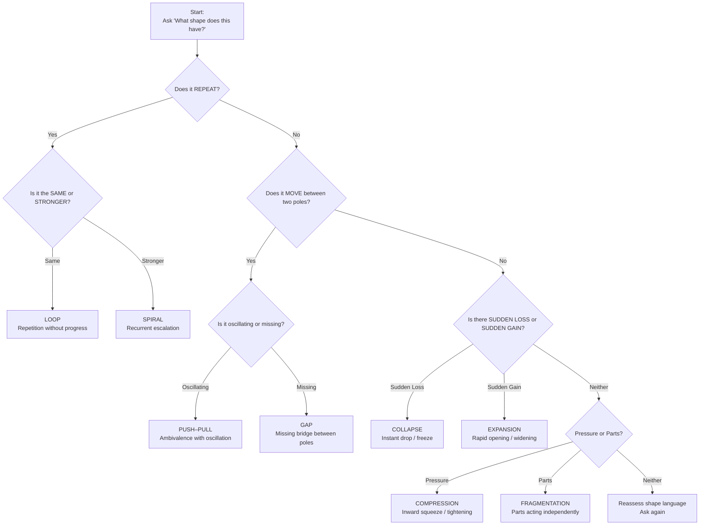

A **one‑page Field Diagnostic Quick Sheet** — a rapid structural assessment tool clinicians can use in real time.  
It’s built for speed, clarity, and accuracy: identify the structure, locate the client, define movement.

No filler — this is the distilled core of ISS + V.I.T.A.L. in field form.

---

# **ISS + V.I.T.A.L. Field Diagnostic Quick Sheet**  
### *Rapid Structural Assessment (One Page)*

---

## **1. Identify the Structural Pattern (8 options)**  
Use the client’s *shape language*, not their content.

| If the client says… | Structure |
|---------------------|-----------|
| “I keep doing this over and over.” | **Loop** |
| “I want it… but I don’t.” | **Push–Pull** |
| “I freeze / shut down instantly.” | **Collapse** |
| “I want to, but I never start.” | **Gap** |
| “Different parts of me take over.” | **Fragmentation** |
| “Everything is pressing inward.” | **Compression** |
| “It keeps coming back stronger.” | **Spiral** |
| “Everything is opening up fast.” | **Expansion** |

**Rule:**  
If the client describes *movement*, identify the **pattern**.  
If they describe *pressure*, identify the **force**.  
If they describe *identity shifts*, identify the **nodes**.

---

## **2. Map the Forces (3–5 seconds)**  
Ask:  
**“What forces are acting inside this?”**

Look for:
- fear  
- desire  
- obligation  
- habit  
- identity pressure  
- relational demand  
- environmental load  

**Goal:** Identify the *engine* of the structure.

---

## **3. Locate the Client’s Position (3–5 seconds)**  
Ask:  
**“Where are you inside this structure?”**

Positions typically fall into:
- inside the loop  
- between poles  
- below the collapse  
- at the edge of the gap  
- inside the spiral  
- at the core of compression  
- inside expansion  
- between parts (fragmentation)

**Rule:**  
Position determines **agency**.

---

## **4. Identify Agency Collapse Point (5 seconds)**  
Ask:  
**“Where does your ability to choose disappear?”**

Collapse points by structure:

| Structure | Agency collapses at… |
|----------|------------------------|
| Loop | reinforcement moment |
| Push–Pull | relational demand |
| Collapse | trigger / evaluation |
| Gap | initiation |
| Fragmentation | part takeover |
| Compression | expression |
| Spiral | re‑entry |
| Expansion | high velocity |

---

## **5. Apply V.I.T.A.L. (10–15 seconds)**  
Run the five dimensions quickly:

- **V – Viewpoint:** immersed or observing?  
- **I – Identity:** which identity nodes are active?  
- **T – Tension:** where is pressure building?  
- **A – Agency:** stable or collapsing?  
- **L – Landscape:** what external forces reinforce the structure?

**Goal:**  
Build a **dimensional snapshot** of the client’s architecture.

---

## **6. Define Movement (10 seconds)**  
Movement is **structure‑specific**:

| Structure | Movement Type |
|----------|----------------|
| Loop | micro‑permission |
| Push–Pull | pause |
| Collapse | pre‑collapse stabilization |
| Gap | micro‑bridge |
| Fragmentation | micro‑coordination |
| Compression | micro‑expansion |
| Spiral | interruption |
| Expansion | anchored expansion |

**Rule:**  
Movement is *not* a solution.  
Movement is a **shift inside the structure**.

---

## **7. Field Summary (30‑second diagnosis)**  
Complete this sentence:

**“You’re in a [structure] with forces of [X], positioned at [Y], with agency collapsing at [Z]. Movement looks like [movement type].”**

Example:  
“You’re in a spiral with forces of fear and perfectionism, positioned inside the tightening cycle, with agency collapsing at re‑entry. Movement looks like interruption.”

This gives the client instant clarity.

---

## **8. Red Flags for Misdiagnosis (avoid these)**  
If you hear:
- “I understand it but I’m still stuck.” → You treated content, not structure.  
- “I feel better but nothing changed.” → You reduced distress, not tension.  
- “I know what to do but I can’t do it.” → You missed the agency collapse point.  
- “I have insight but no movement.” → You missed the structural engine.  

---

## **9. The 10‑Second Reset (if stuck)**  
Ask the client:

**“What shape does this have?”**

Their answer reveals the structure instantly.

---

A **structural decision tree for ultra‑fast identification** — designed exactly the way ISS + V.I.T.A.L. works in the field: fast, shape‑based, and architecture‑first.  
This is the quickest way to identify a client’s (or your own) structural pattern in under 10 seconds.

---

# **ISS + V.I.T.A.L. Structural Decision Tree**  
### *Ultra‑Fast Identification (Field Use)*

---

## **START HERE**  
Ask the client (or yourself):

**“What shape does this experience have?”**

Then follow the branches below.

---

## **1. Does the experience REPEAT?**
### **Yes → Is it repeating in a circle or escalating?**
- **Same thing over and over?** → **LOOP**  
- **Comes back stronger each time?** → **SPIRAL**

### **No → Go to 2**

---

## **2. Does the experience MOVE between two poles?**
### **Yes → Is the movement oscillating or missing?**
- **Back‑and‑forth between two desires?** → **PUSH–PULL**  
- **Stuck on one side, can’t reach the other?** → **GAP**

### **No → Go to 3**

---

## **3. Does the experience involve SUDDEN LOSS or SUDDEN GAIN?**
### **Sudden loss → COLLAPSE**
- Instant freeze  
- Trapdoor feeling  
- Agency disappears immediately  

### **Sudden gain → EXPANSION**
- Opening  
- Widening  
- Too many possibilities  
- Agency collapses at high velocity  

### **Neither → Go to 4**

---

## **4. Does the experience involve PRESSURE or MULTIPLE PARTS?**
### **Pressure → COMPRESSION**
- Tightening  
- Inward squeeze  
- Reduced emotional space  

### **Multiple parts → FRAGMENTATION**
- Different “versions” of self  
- Parts acting independently  
- Sudden shifts in control  

### **Neither → Reassess shape language**

---

# **Decision Tree Summary (One‑Line Identifiers)**

| Structural Pattern | Fast Identifier |
|--------------------|-----------------|
| **Loop** | “Same thing again.” |
| **Push–Pull** | “I want it… but I don’t.” |
| **Collapse** | “I freeze instantly.” |
| **Gap** | “I want to, but I never start.” |
| **Fragmentation** | “Different parts take over.” |
| **Compression** | “Everything is pressing inward.” |
| **Spiral** | “It keeps coming back stronger.” |
| **Expansion** | “Everything is opening up fast.” |

---

# **Ultra‑Fast Field Algorithm (5 seconds)**

1. **Is it repeating?**  
   - Yes → Loop or Spiral  
2. **Is it oscillating?**  
   - Yes → Push–Pull  
3. **Is something missing?**  
   - Yes → Gap  
4. **Is there sudden collapse?**  
   - Yes → Collapse  
5. **Is there inward pressure?**  
   - Yes → Compression  
6. **Are there multiple parts?**  
   - Yes → Fragmentation  
7. **Is it widening?**  
   - Yes → Expansion  

If none fit → ask again:  
**“What shape does this have?”**

The shape always reveals the structure.

---

## **How to use this flowchart in the field**
1. Ask the client: **“What shape does this have?”**  
2. Follow the branches exactly as written.  
3. Identify the structure in under 10 seconds.  
4. Once identified, apply the movement type for that structure.

This is the fastest structural diagnostic tool in the ISS + V.I.T.A.L. system.

---
