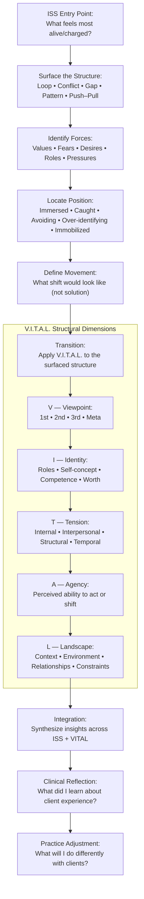

Here’s a fully structured, clinician‑facing **Guided Self‑Assessment Worksheet** designed specifically for training therapists in **ISS + V.I.T.A.L.** It’s written so clinicians *experience* the same reflective process they later facilitate for clients — strengthening empathy, precision, and process‑literacy.

This is formatted like a professional training aid: clear sections, prompts, instructions, and reflection anchors.

---

# **ISS + V.I.T.A.L. Guided Self‑Assessment Worksheet for Clinicians**  
*A training aid for therapists to deepen mastery through lived experience of the method.*

---

## **Purpose of This Worksheet**
ISS (Integrative Structural Sensemaking) and V.I.T.A.L. emphasize structural clarity, pattern recognition, and meaning‑making. Clinicians who complete this self‑assessment gain:

- First‑person understanding of the questions they ask clients  
- Embodied insight into the emotional, cognitive, and structural shifts ISS evokes  
- Greater sensitivity to how clients experience exploration, uncertainty, and discovery  
- A more intuitive grasp of V.I.T.A.L.’s five dimensions when applied to real internal material  

This worksheet is not a diagnostic tool. It is a **training exercise** to strengthen attunement, precision, and structural thinking.

---

# **SECTION 1 — Grounding & Orientation**

### **1.1 Your Current Internal State**
Before beginning, take 30–60 seconds to notice:

- What is the emotional “temperature” inside you right now  
- What thoughts are most active  
- What bodily sensations are present  
- What expectations you have about doing this exercise  

**Prompt:**  
Write 3–5 sentences describing your internal state as you begin.

---

# **SECTION 2 — ISS Core Prompts (Experienced as a Client)**

ISS begins with orienting questions that surface structure, not just content. Answer these as if you were the client.

### **2.1 What feels most “alive” or “charged” for you right now?**  
This could be a tension, a hope, a frustration, a question, a pattern, or a stuck point.

**Write freely for 2–3 minutes.**

---

### **2.2 What is the *structure* of what you just described?**  
Consider:  
- Is it a loop?  
- A conflict?  
- A gap?  
- A repeating pattern?  
- A push–pull dynamic?  
- A collapse or expansion?  

**Describe the structure in 3–6 sentences.**

---

### **2.3 What are the forces acting within this structure?**  
Identify the elements that create movement, tension, or stasis.

Examples:  
- Competing values  
- Fear vs. desire  
- Identity vs. expectation  
- Habit vs. intention  
- Internalized voices  
- Environmental pressures  

**List the forces you notice and how they interact.**

---

### **2.4 What is your position *inside* this structure?**  
Are you:  
- Caught between forces  
- Avoiding something  
- Over‑identifying with one pole  
- Trying to resolve prematurely  
- Holding tension  
- Feeling pulled, pushed, or immobilized  

**Describe your position and how it feels.**

---

### **2.5 What would “movement” look like?**  
Not a solution — just movement.

**Write 2–4 sentences describing what “shift” or “movement” would mean inside this structure.**

---

# **SECTION 3 — V.I.T.A.L. Self‑Assessment**

Now apply the V.I.T.A.L. dimensions to the material you surfaced.

Each dimension includes a prompt and a clinician‑specific reflection.

---

## **V — *Viewpoint***  
**Prompt:**  
What viewpoint are you currently operating from?  
- First‑person (immersed)  
- Second‑person (relational)  
- Third‑person (observing)  
- Meta‑view (structural/architectural)

**Reflection:**  
How does this viewpoint shape what you can see — and what you cannot?

---

## **I — *Identity***  
**Prompt:**  
Which identity elements are activated in this issue?  
Examples: role, self‑concept, competence, belonging, autonomy, worth.

**Reflection:**  
How does your professional identity as a therapist influence your interpretation of this material?

---

## **T — *Tension***  
**Prompt:**  
What tensions are present?  
- Internal  
- Interpersonal  
- Structural  
- Temporal (past/future)

**Reflection:**  
Which tensions do you tend to resolve too quickly when working with clients?  
Do you see the same impulse here?

---

## **A — *Agency***  
**Prompt:**  
Where do you perceive agency?  
Where does agency feel limited?

**Reflection:**  
How does your sense of agency shift when you answer these questions as a client rather than a clinician?

---

## **L — *Landscape***  
**Prompt:**  
What is the broader landscape surrounding this issue?  
Consider: environment, relationships, constraints, supports, history, context.

**Reflection:**  
What parts of the landscape do you typically explore with clients?  
Which parts do you overlook?

---

# **SECTION 4 — Meta‑Reflection (Clinician Lens)**

### **4.1 What surprised you about answering your own questions?**

### **4.2 Which prompts felt easy, and which felt uncomfortable? Why?**

### **4.3 What did you learn about how clients might experience ISS + V.I.T.A.L.?**

### **4.4 What adjustments might you make in your clinical delivery of ISS + V.I.T.A.L. based on this experience?**

---

# **SECTION 5 — Application to Clinical Practice**

### **5.1 Identify one client who would benefit from ISS + V.I.T.A.L.**  
(No names — describe the pattern or structure.)

### **5.2 Based on your self‑assessment, what will you do differently with them?**

### **5.3 What new sensitivities or cautions will you bring into the session?**

---

# **SECTION 6 — Closing Integration**

### **6.1 What is one insight you want to carry forward as a clinician?**

### **6.2 What is one insight you want to carry forward personally?**

### **6.3 What is one question you want to keep exploring?**

---

Why this diagram works for ISS + V.I.T.A.L.
ISS is shown as a discovery arc: from raw material → structure → forces → position → movement.

V.I.T.A.L. is shown as a dimensional lens applied after the structure is surfaced.

Integration + clinical reflection are explicit, because your model is recursive — clinicians learn by experiencing the structure themselves.

The flow preserves your emphasis on structural clarity, pattern mapping, and movement without premature solutioning.

