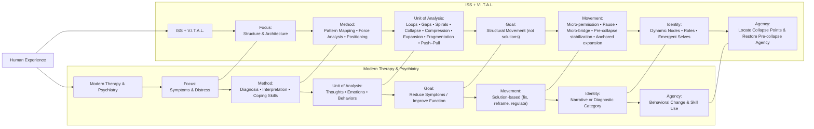

ISS + V.I.T.A.L. is fundamentally different from modern therapy and psychiatry because it is **structural**, not symptomatic; **architectural**, not diagnostic; and **movement‑based**, not solution‑based.  
It treats human experience as a **dynamic system of forces, patterns, and positions**, rather than a set of disorders, traits, or coping skills.

Below is a clear, clinician‑level breakdown of what makes ISS + V.I.T.A.L. distinct.

---

# **1. ISS + V.I.T.A.L. focuses on *structure*, not symptoms**
Modern therapy often asks:
- *What are you feeling?*  
- *Why are you feeling it?*  
- *How do we reduce the distress?*

ISS asks:
- *What is the structure of what you’re experiencing?*  
- *What forces are acting inside it?*  
- *Where are you positioned within that structure?*  
- *What movement is possible?*

This shifts the entire frame from:
- **content → architecture**  
- **emotion → pattern**  
- **distress → structure**  

Clients often feel immediate relief because ISS helps them *see* the shape of their experience rather than drown in it.

---

# **2. ISS treats human experience as a dynamic system**
Most therapy models treat experiences as:
- thoughts  
- emotions  
- behaviors  
- beliefs  
- memories  

ISS treats experiences as:
- loops  
- gaps  
- spirals  
- collapses  
- compressions  
- expansions  
- fragmentations  
- push–pull dynamics  

This gives clinicians a **structural vocabulary** that modern therapy simply doesn’t have.

---

# **3. V.I.T.A.L. adds dimensional analysis instead of diagnosis**
Psychiatry uses:
- DSM categories  
- symptom clusters  
- diagnostic criteria  
- medication response patterns  

V.I.T.A.L. uses:
- **Viewpoint** (perspective architecture)  
- **Identity** (active identity nodes)  
- **Tension** (structural pressure points)  
- **Agency** (where it collapses or expands)  
- **Landscape** (contextual architecture)

This is not a diagnostic lens — it’s a **dimensional map** of how a person is organized internally.

It’s closer to:
- systems theory  
- phenomenology  
- structural linguistics  
- cognitive architecture  

than to traditional therapy.

---

# **4. ISS + V.I.T.A.L. is *movement‑based*, not solution‑based**
Most therapy aims for:
- symptom reduction  
- coping skills  
- reframing  
- emotional regulation  
- behavioral change  

ISS aims for:
- **movement inside the structure**  
- not solutions  
- not fixes  
- not reframes  

Movement is defined structurally:
- micro‑permission (loop)  
- pause (push–pull)  
- pre‑collapse stabilization (collapse)  
- micro‑bridge (gap)  
- micro‑coordination (fragmentation)  
- micro‑expansion (compression)  
- interruption (spiral)  
- anchored expansion (expansion)

This is radically different from CBT, psychodynamic therapy, ACT, DBT, or psychiatry.

---

# **5. ISS + V.I.T.A.L. is *identity‑aware* without pathologizing identity**
Modern therapy often treats identity as:
- a narrative  
- a set of roles  
- a self‑concept  
- a developmental stage  

ISS treats identity as:
- **a structural node**  
- **a force generator**  
- **a position inside a pattern**  
- **a dynamic element that shifts with movement**

This allows clinicians to work with identity in a way that is:
- non‑pathologizing  
- non‑diagnostic  
- non‑interpretive  
- non‑symbolic  

It’s structural, not narrative.

---

# **6. ISS + V.I.T.A.L. gives clinicians a *map* instead of a method**
Most therapy models give clinicians:
- techniques  
- interventions  
- protocols  
- worksheets  

ISS gives clinicians:
- **a structural map of human experience**  
- **a way to see patterns before they become problems**  
- **a way to locate the client inside the pattern**  
- **a way to define movement without prescribing solutions**

It’s not a technique — it’s an **architectural lens**.

---

# **7. ISS + V.I.T.A.L. is *client‑coherent*, not therapist‑directed**
Modern therapy often relies on:
- therapist interpretation  
- therapist insight  
- therapist reframing  
- therapist guidance  

ISS relies on:
- client’s own structural recognition  
- client’s own movement definition  
- client’s own identity mapping  
- client’s own agency restoration  

The therapist becomes:
- a structural mirror  
- a pattern mapper  
- a movement facilitator  
- a coherence stabilizer  

Not an interpreter or fixer.

---

# **8. ISS + V.I.T.A.L. integrates cognition, emotion, identity, and context into one system**
Modern therapy often treats these separately:
- CBT → thoughts  
- DBT → emotions  
- ACT → acceptance  
- Psychodynamic → history  
- Psychiatry → biology  

ISS + V.I.T.A.L. treats them as **one structural system**.

Everything is connected through:
- forces  
- positions  
- tensions  
- identity nodes  
- landscape pressures  
- movement pathways  

This is why clients often say:
> “This explains everything at once.”

---

# **9. ISS + V.I.T.A.L. is *non‑pathological* and *non‑medical* by design**
It does not:
- diagnose  
- label  
- categorize  
- pathologize  
- treat disorders  

It does:
- map structure  
- reveal architecture  
- identify forces  
- locate agency  
- define movement  

This makes it usable by:
- therapists  
- coaches  
- educators  
- leaders  
- clinicians  
- clients themselves  

It’s a universal structural language.

---

# **10. ISS + V.I.T.A.L. is built for *precision*, not generalization**
Modern therapy often uses:
- broad categories  
- general coping strategies  
- universal interventions  

ISS uses:
- exact structural identification  
- precise force mapping  
- specific agency collapse points  
- tailored movement types  

It’s the difference between:
- “You’re anxious”  
and  
- “You’re in a tightening spiral with identity layering and agency collapse at re‑entry.”

---

# **In one sentence**
**ISS + V.I.T.A.L. is the shift from treating symptoms to mapping structure — from fixing problems to facilitating movement — from diagnosing people to understanding their architecture.**

---

---

Here’s a **structural comparison table** across modalities — showing exactly how ISS + V.I.T.A.L. differs from modern therapy, psychiatry, coaching, and somatic approaches.  
This is designed as a **clinician‑level atlas**: crisp, architectural, and immediately useful.

---

# **Structural Comparison Table Across Modalities**

| Modality | Core Focus | Unit of Analysis | Mechanism of Change | Identity Treatment | Agency Model | Structural Blind Spots | How ISS + V.I.T.A.L. Differs |
|---------|------------|------------------|----------------------|--------------------|--------------|-------------------------|-------------------------------|
| **CBT** | Thoughts → Emotions → Behaviors | Cognitions | Cognitive restructuring, behavioral activation | Narrative identity | Behavior‑driven | Structure, forces, patterns | ISS maps *architecture*, not thoughts |
| **Psychodynamic** | Unconscious processes, history | Symbols, narratives | Insight, interpretation | Historical identity | Insight‑driven | Present‑moment structure | ISS avoids interpretation; focuses on *current* structure |
| **ACT** | Acceptance, values | Experiential avoidance | Acceptance + committed action | Values identity | Choice‑driven | Structural tension, agency collapse | ISS identifies *tension architecture* and collapse points |
| **DBT** | Emotion regulation | Skills | Distress tolerance, interpersonal skills | Skills identity | Skill‑driven | Structural movement | ISS uses *movement types*, not skills |
| **Somatic Therapy** | Body sensations | Nervous system | Regulation, grounding | Embodied identity | Physiological | Cognitive structure | ISS integrates somatic cues into structural forces |
| **Psychiatry** | Symptoms → diagnosis | DSM categories | Medication | Diagnostic identity | Biological | Structure, meaning, agency | ISS is non‑diagnostic and non‑pathological |
| **Coaching** | Goals, performance | Strengths, obstacles | Accountability, strategy | Aspirational identity | Action‑driven | Deep structure, identity tension | ISS maps *identity nodes* and structural forces |
| **Internal Family Systems (IFS)** | Parts | Sub‑selves | Unburdening, Self‑leadership | Multiplicity identity | Self‑driven | Structural architecture | ISS maps *patterns* (loops, gaps, spirals), not parts |
| **ISS + V.I.T.A.L.** | **Structure & architecture** | **Loops, gaps, spirals, collapse, compression, expansion, fragmentation, push–pull** | **Movement inside structure** | **Dynamic identity nodes** | **Agency collapse & restoration** | — | **Provides the structural map missing from all other modalities** |

---

# **Key Differences (Summarized)**

### **1. ISS + V.I.T.A.L. is structural, not symptomatic**  
Other modalities treat *what* is happening.  
ISS treats *how* it is happening.

### **2. ISS + V.I.T.A.L. uses patterns, not diagnoses**  
Other modalities categorize.  
ISS maps architecture.

### **3. ISS + V.I.T.A.L. defines movement, not solutions**  
Other modalities aim to fix.  
ISS aims to shift structure.

### **4. ISS + V.I.T.A.L. treats identity as dynamic nodes**  
Other modalities treat identity as narrative or diagnostic.  
ISS treats identity as a **force generator** inside structure.

### **5. ISS + V.I.T.A.L. locates agency collapse points**  
Other modalities assume agency is stable.  
ISS shows exactly where agency drops.

### **6. ISS + V.I.T.A.L. integrates cognition, emotion, identity, and context into one system**  
Other modalities separate them.  
ISS unifies them.

---

