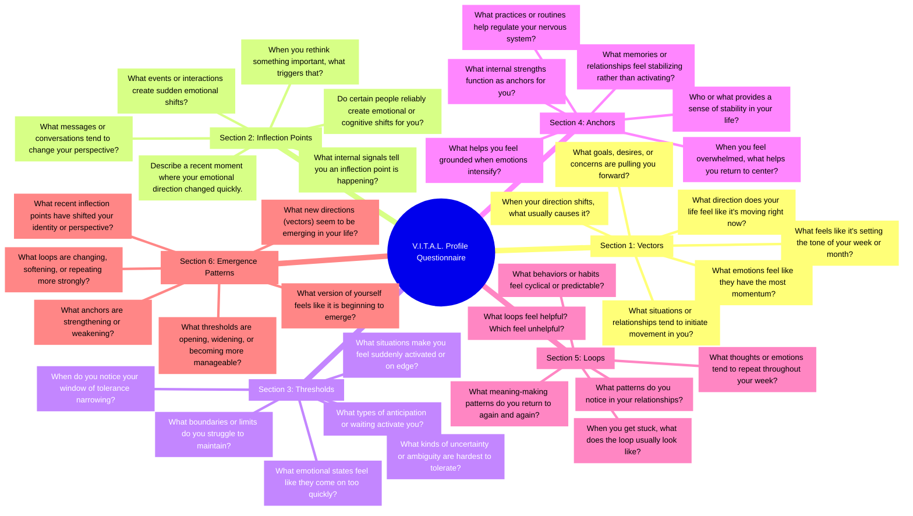

# **V.I.T.A.L. Profile Questionnaire**  
### *A Guided Clinical Assessment for Mapping Inner Dynamics*

This questionnaire helps therapists identify a client’s **Vectors**, **Inflection Points**, **Thresholds**, **Anchors**, and **Loops** so treatment can be targeted, precise, and structurally informed.

---

## **SECTION 1 — VECTORS**  
### *Direction, Intention, Momentum*

**Purpose:** Identify where the client’s emotional system is *moving* and what is driving that movement.

1. What direction does your life feel like it’s moving right now?  
2. What goals, desires, or concerns are currently pulling you forward?  
3. What emotions feel like they have the most momentum?  
4. What situations or relationships tend to initiate movement in you?  
5. When you feel a shift in direction, what usually causes it?  
6. What feels like it is “setting the tone” of your week or month?

**Therapist Notes:**  
Identify primary vectors (e.g., hope, fear, avoidance, curiosity, relational longing, achievement drive).

---

## **SECTION 2 — INFLECTION POINTS**  
### *Emotional & Cognitive Shifts*

**Purpose:** Identify moments that change the client’s trajectory.

1. What kinds of events or interactions create sudden emotional shifts for you?  
2. When you “rethink” something important, what usually triggers that?  
3. What messages, conversations, or memories tend to change your perspective?  
4. Describe a recent moment where your emotional direction changed quickly.  
5. What internal signals tell you an inflection point is happening?  
6. Do certain people reliably create emotional or cognitive shifts for you?

**Therapist Notes:**  
Track common inflection triggers (e.g., relational cues, uncertainty, conflict, validation, disappointment).

---

## **SECTION 3 — THRESHOLDS**  
### *Activation, Sensitivity, Boundaries*

**Purpose:** Identify where the client becomes reactive, overwhelmed, or highly sensitive.

1. What situations make you feel suddenly activated or on edge?  
2. What kinds of uncertainty or ambiguity are hardest for you to tolerate?  
3. When do you notice your “window of tolerance” narrowing?  
4. What emotional states feel like they come on too quickly?  
5. What boundaries or limits do you struggle to maintain?  
6. What types of anticipation or waiting activate you?

**Therapist Notes:**  
Identify threshold types (emotional, relational, cognitive, sensory) and sensitivity patterns.

---

## **SECTION 4 — ANCHORS**  
### *Stability, Grounding, Regulation*

**Purpose:** Identify what stabilizes the client during transitions or activation.

1. What helps you feel grounded when emotions intensify?  
2. Who or what provides a sense of stability in your life?  
3. What practices or routines help regulate your nervous system?  
4. What memories or relationships feel stabilizing rather than activating?  
5. When you feel overwhelmed, what helps you return to center?  
6. What internal strengths function as anchors for you?

**Therapist Notes:**  
Identify internal anchors (skills, values, self‑talk) and external anchors (relationships, routines, environments).

---

## **SECTION 5 — LOOPS**  
### *Recurrence, Reinforcement, Feedback*

**Purpose:** Identify repeating emotional, cognitive, or behavioral patterns.

1. What thoughts or emotions tend to repeat throughout your week?  
2. What patterns do you notice in your relationships?  
3. What behaviors or habits feel cyclical or predictable?  
4. When you get stuck, what does the loop usually look like?  
5. What meaning‑making patterns do you return to again and again?  
6. What loops feel helpful? Which feel unhelpful?

**Therapist Notes:**  
Identify reinforcing cycles (rumination, hope‑fear oscillation, avoidance loops, relational repetition).

---

## **SECTION 6 — EMERGENCE PATTERNS**  
### *Putting the VITAL Profile Together*

**Purpose:** Help the therapist see the client’s system as a whole.

1. What new directions (vectors) seem to be emerging in your life?  
2. What recent inflection points have shifted your identity or perspective?  
3. What thresholds are opening, widening, or becoming more manageable?  
4. What anchors are strengthening or weakening?  
5. What loops are changing, softening, or repeating more strongly?  
6. What version of yourself feels like it is beginning to emerge?

**Therapist Notes:**  
Use this section to build a dynamic case formulation and identify leverage points for intervention.

---

## **SECTION 7 — CLINICAL TARGETING GUIDE**  
### *How to Use the VITAL Profile in Treatment*

After completing the questionnaire, therapists can target interventions:

- **Vector Work:** Clarify direction, strengthen intention, reduce chaotic momentum.  
- **Inflection Work:** Build emotional regulation, cognitive flexibility, and reframing skills.  
- **Threshold Work:** Expand window of tolerance, reduce sensitivity, strengthen resilience.  
- **Anchor Work:** Develop grounding practices, relational supports, and stabilizing routines.  
- **Loop Work:** Interrupt unhelpful cycles, reinforce adaptive patterns, reshape meaning-making.

This turns therapy into a **structural intervention**, not just symptom management.

---

