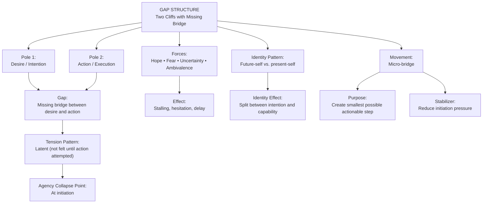
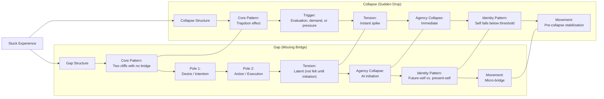

# **Case Study 4: ISS + V.I.T.A.L. Applied to a Gap Structure**  
*A therapist works with a client experiencing a disconnect between intention and action.*

---

## **Client Snapshot**
**Client:** “Sam,” 33, software engineer  
**Presenting Issue:** Persistent difficulty initiating meaningful personal projects  
**Underlying Structure:** Gap — a missing bridge between desire and execution  
**Therapeutic Goal:** Increase structural clarity, identify the nature of the gap, and strengthen connective pathways

---

# **Part 1 — ISS in Action**

## **1. ISS Entry Point**
Therapist:

> “What feels most alive or charged for you right now?”

**Client Response:**  
“I want to start things — exercise, creative projects, reconnecting with friends — but I never actually begin. It’s like there’s a space between wanting and doing.”

**Clinician Note:**  
The “alive” material is the **space** — the gap — not the projects.

---

## **2. Surface the Structure**
Therapist:

> “If you look at this as a structure, what shape does it have?”

**Client:**  
“It feels like two cliffs with nothing in between. I’m on one side wanting something, and the other side is where action happens, but there’s no bridge.”

**Clinician Note:**  
Structure identified: **Gap**  
- Two poles: desire ↔ action  
- Missing connective tissue  
- No tension, no oscillation — just absence

---

## **3. Identify Forces**
Therapist:

> “What forces are acting inside this gap?”

**Client Identifies:**  
- Desire for change  
- Fear of failure  
- Habit of overthinking  
- Lack of emotional energy  
- Perfectionism  
- Unclear first steps

**Clinician Note:**  
Forces exist on both sides of the gap but do not connect.

---

## **4. Locate Position**
Therapist:

> “Where are you inside this structure?”

**Client:**  
“I’m stuck on the desire side. I can see the action side, but I can’t get there.”

**Clinician Note:**  
Client is positioned **at the edge of the gap**, unable to cross.

---

## **5. Define Movement**
Therapist:

> “Not a solution — just movement. What would a shift look like?”

**Client:**  
“Maybe finding one small stepping stone. Something tiny that gets me off the edge.”

**Clinician Note:**  
Movement = **micro‑connection**, not full action.

---

# **Part 2 — Applying V.I.T.A.L.**

## **V — Viewpoint**
**Client Viewpoint:** First‑person immersed  
**Shift:** Therapist invites meta‑view:

> “If you observe the gap from above, what do you see?”

**Client:**  
“It’s not that I’m lazy. There’s just nothing connecting the two sides.”

---

## **I — Identity**
Therapist:

> “Which identities are activated?”

**Client:**  
“The ideal version of me. And the version that’s stuck.”

**Clinician Note:**  
Identity split between **aspirational identity** and **current identity**.

---

## **T — Tension**
**Tensions Identified:**  
- Internal: desire vs. fear  
- Structural: absence of connection  
- Temporal: future self vs. present self  
- Emotional: hope vs. discouragement

**Clinician Note:**  
Gap structures often have *low visible tension but high latent tension*.

---

## **A — Agency**
Therapist:

> “Where do you feel agency? Where does it collapse?”

**Client:**  
“I feel agency when imagining the future. It collapses when I try to start.”

**Clinician Note:**  
Agency collapses at the **moment of initiation**.

---

## **L — Landscape**
Client maps the broader landscape:  
- High cognitive load from work  
- Limited social support  
- Perfectionistic family culture  
- Lack of structured routines  
- Emotional fatigue  
- No clear scaffolding for new habits

**Clinician Note:**  
Landscape reveals environmental factors widening the gap.

---

# **Part 3 — Integration**

Therapist:

> “What do you see now that you couldn’t see at the beginning?”

**Client:**  
“That the problem isn’t motivation. It’s the missing connection between wanting and doing.”

---

## **Clinical Insight**
Therapist reflects:  
- The client’s struggle is structural, not motivational  
- The gap metaphor reveals absence rather than conflict  
- Identity split contributes to the gap  
- Agency restoration must occur at the **initiation point**  
- Movement should focus on micro‑bridges, not full action plans

---

## **Practice Adjustment**
Therapist plans to:  
- Identify micro‑bridges (tiny first steps)  
- Strengthen identity coherence  
- Reduce perfectionistic barriers  
- Use ISS to track gap narrowing  
- Use V.I.T.A.L. to map identity split and tension points  
- Introduce scaffolding for initiation moments

---

# **Part 4 — Training Notes for Clinicians**

### **Why this case is effective for training**
- Demonstrates ISS with a **gap structure**, distinct from loops, push–pull, and collapse  
- Shows how absence can be structural  
- Highlights identity splits as drivers of gaps  
- Models how movement is defined as micro‑connection  
- Shows V.I.T.A.L. clarifying latent tension and agency collapse

### **How to use this in training**
- Have clinicians map the gap visually (two cliffs metaphor)  
- Ask them to identify micro‑bridges  
- Have them run ISS prompts on their own gap patterns  
- Compare their own identity splits with the client’s  
- Discuss how viewpoint shifts reveal hidden structural absence

---

Here’s a clean, structural **Mermaid diagram of the Gap Structure** — showing the architecture, forces, agency collapse point, and movement.  
You can paste this directly into VS Code, Obsidian, or any Mermaid-enabled environment.

---

## **Mermaid Diagram — Gap Structure (ISS)**

---

## **How to read this diagram**
- **Two poles** exist: what you *want* and what you *do*.  
- The **bridge is missing**, creating the Gap.  
- **Tension is latent** — you don’t feel it until you try to act.  
- **Agency collapses at initiation**, not during the action itself.  
- The **identity split** is between the future-self (vision) and present-self (capacity).  
- The movement is **micro‑bridge** — the smallest possible step that spans the gap.

This is one of the most common ISS structures and often misinterpreted as procrastination, avoidance, or lack of motivation.  
Structurally, it’s none of those — it’s a missing bridge.

---

## **Gap vs. Collapse** comparison diagram  

Here’s a clean, structural **Mermaid diagram comparing Gap vs. Collapse** — showing how these two ISS patterns differ in architecture, tension, agency, and movement.  
This is non‑clinical, non‑diagnostic, and purely structural.

You can paste this directly into VS Code, Obsidian, or any Mermaid-enabled environment.

---

## **Mermaid Diagram — Gap vs. Collapse (ISS Structural Comparison)**

---

## **How to read this diagram**

### **Gap Structure**
- Two poles: *desire* and *action*.  
- The bridge is missing → the person cannot initiate.  
- Tension is **latent** until they try to act.  
- Agency collapses **at the first step**.  
- Identity splits between “future self” and “present self.”  
- Movement is **micro‑bridge** — the smallest possible actionable step.

### **Collapse Structure**
- A sudden drop in agency — the “trapdoor.”  
- Triggered by evaluation, pressure, or demand.  
- Tension spikes instantly.  
- Agency collapses **immediately**, not gradually.  
- Identity falls below a threshold (“I can’t”).  
- Movement is **pre‑collapse stabilization** — slowing the drop before it happens.

---

