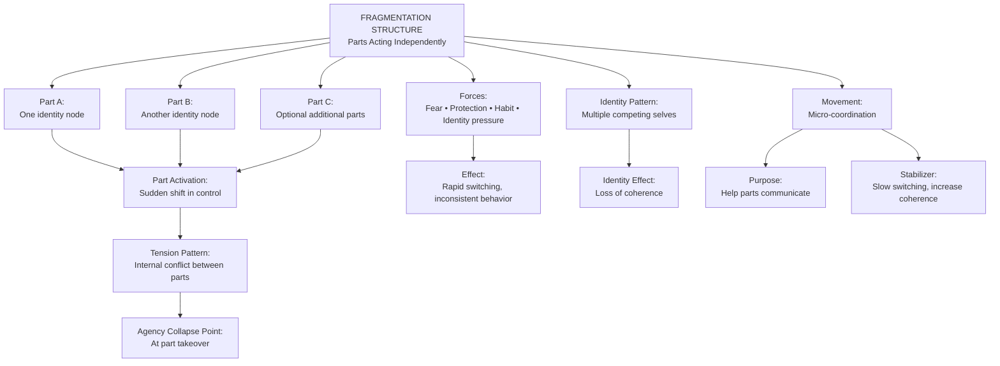
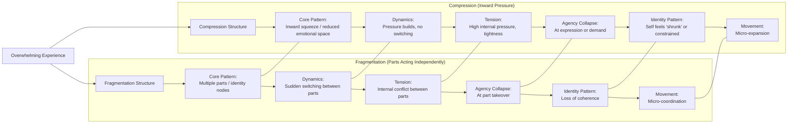

# **Case Study 5: ISS + V.I.T.A.L. Applied to a Fragmentation Structure**  
*A therapist works with a client experiencing internal parts that operate independently and inconsistently.*

---

## **Client Snapshot**
**Client:** “Riley,” 41, creative director  
**Presenting Issue:** Inconsistent motivation, contradictory decisions, and sudden shifts in emotional state  
**Underlying Structure:** Fragmentation — multiple internal parts acting without coordination  
**Therapeutic Goal:** Increase structural awareness, identify distinct parts, and build internal communication pathways

---

# **Part 1 — ISS in Action**

## **1. ISS Entry Point**
Therapist:

> “What feels most alive or charged for you right now?”

**Client Response:**  
“I feel like different versions of me keep taking over. One part wants to push forward, another shuts down, another gets angry. I don’t know which one is ‘me.’”

**Clinician Note:**  
The “alive” material is the **multiplicity** — not any single part.

---

## **2. Surface the Structure**
Therapist:

> “If you look at this as a structure, what shape does it have?”

**Client:**  
“It’s like a room with several people talking over each other. None of them listen.”

**Clinician Note:**  
Structure identified: **Fragmentation**  
- Multiple internal parts  
- No shared communication  
- No coherent center  
- Sudden shifts in control

---

## **3. Identify Forces**
Therapist:

> “What forces are acting inside this fragmentation?”

**Client Identifies:**  
- A driven part that wants achievement  
- A fearful part that avoids risk  
- A protective part that gets angry  
- A tired part that wants rest  
- A perfectionistic part that blocks action

**Clinician Note:**  
Each part has its own force, agenda, and emotional tone.

---

## **4. Locate Position**
Therapist:

> “Where are you inside this structure?”

**Client:**  
“I’m not sure. Sometimes I’m watching them. Sometimes I’m one of them. Sometimes I disappear.”

**Clinician Note:**  
Client’s position is **unstable**, shifting between parts and observer.

---

## **5. Define Movement**
Therapist:

> “Not a solution — just movement. What would a shift look like?”

**Client:**  
“Maybe getting two of them to talk. Or having one step back so another can speak.”

**Clinician Note:**  
Movement = **micro‑coordination**, not integration.

---

# **Part 2 — Applying V.I.T.A.L.**

## **V — Viewpoint**
**Client Viewpoint:** Alternating between first‑person (part‑identified) and third‑person (observer)  
**Shift:** Therapist invites meta‑view:

> “If you observe the parts from above, what do you see?”

**Client:**  
“They’re all trying to protect me in different ways.”

---

## **I — Identity**
Therapist:

> “Which identities are activated?”

**Client:**  
“All of them. That’s the problem. I don’t know which one is the real me.”

**Clinician Note:**  
Identity fragmentation is central — multiple identity nodes without a coherent core.

---

## **T — Tension**
**Tensions Identified:**  
- Internal: parts competing for control  
- Structural: lack of communication  
- Emotional: fear vs. drive vs. anger vs. exhaustion  
- Temporal: parts formed at different life stages

**Clinician Note:**  
Fragmentation creates **multi‑directional tension**, not binary tension.

---

## **A — Agency**
Therapist:

> “Where do you feel agency? Where does it collapse?”

**Client:**  
“I feel agency when the driven part is in charge. I lose it when the fearful or tired parts take over.”

**Clinician Note:**  
Agency is **part‑dependent**, not stable.

---

## **L — Landscape**
Client maps the broader landscape:  
- High-pressure creative environment  
- Childhood history of inconsistent caregiving  
- Trauma around unpredictability  
- Lack of stable routines  
- Emotional burnout  
- Social expectations to “be consistent”

**Clinician Note:**  
Landscape reveals environmental factors reinforcing fragmentation.

---

# **Part 3 — Integration**

Therapist:

> “What do you see now that you couldn’t see at the beginning?”

**Client:**  
“That the parts aren’t random. They each have a job. They’re just not working together.”

---

## **Clinical Insight**
Therapist reflects:  
- Fragmentation is structural, not pathological  
- Each part has a protective function  
- Agency is distributed across parts  
- Movement must focus on **coordination**, not elimination  
- V.I.T.A.L. reveals how identity nodes formed and why they conflict

---

## **Practice Adjustment**
Therapist plans to:  
- Identify each part’s role and origin  
- Build micro‑communication between parts  
- Strengthen the observer position  
- Use ISS to track part activation patterns  
- Use V.I.T.A.L. to map identity nodes and tension webs  
- Introduce grounding techniques to stabilize part transitions

---

# **Part 4 — Training Notes for Clinicians**

### **Why this case is effective for training**
- Demonstrates ISS with a **fragmentation structure**, distinct from loops, push–pull, collapse, and gaps  
- Shows how multiplicity can be structural rather than pathological  
- Highlights identity nodes as drivers of fragmentation  
- Models how movement is defined as micro‑coordination  
- Shows V.I.T.A.L. clarifying part roles, tensions, and agency distribution

### **How to use this in training**
- Have clinicians map the parts visually (nodes with no edges)  
- Ask them to identify potential micro‑connections  
- Have them run ISS prompts on their own internal contradictions  
- Compare their own part dynamics with the client’s  
- Discuss how viewpoint shifts stabilize fragmentation

---

Here’s a clean, structural **Mermaid diagram of the Fragmentation Structure** — showing how ISS models parts, identity shifts, agency collapse, and movement.  
You can paste this directly into VS Code, Obsidian, or any Mermaid-enabled environment.

---

## **Mermaid Diagram — Fragmentation Structure (ISS)**

---

## **How to read this diagram**
- **Multiple parts** (identity nodes) activate independently.  
- The person experiences **internal conflict** as parts disagree or compete.  
- **Agency collapses** when one part suddenly takes over.  
- The identity feels **split**, not unified.  
- Movement is **micro‑coordination** — helping parts communicate, align, or soften transitions.

Fragmentation is not pathology — it’s a **structure** describing how identity behaves under tension.

---

## **Fragmentation vs. Compression** comparison  

Here’s a **clear, structural Mermaid diagram comparing Fragmentation vs. Compression** — two ISS patterns that *look* similar on the surface (both feel overwhelming), but behave very differently internally.

You can paste this directly into VS Code, Obsidian, or any Mermaid-enabled environment.

---

## **Mermaid Diagram — Fragmentation vs. Compression (ISS Structural Comparison)**

---

## **How to read this diagram**

### **Fragmentation**
- Experience breaks into **parts**.  
- Parts **switch control** rapidly.  
- Tension is **conflict** between parts.  
- Agency collapses when a part **takes over**.  
- Identity feels **split** or inconsistent.  
- Movement is **micro‑coordination** — helping parts communicate.

### **Compression**
- Experience becomes **tight**, squeezed inward.  
- No switching — just **pressure**.  
- Tension is **density**, not conflict.  
- Agency collapses when asked to **express** or act.  
- Identity feels **small**, constrained, or overloaded.  
- Movement is **micro‑expansion** — creating small pockets of space.

---

