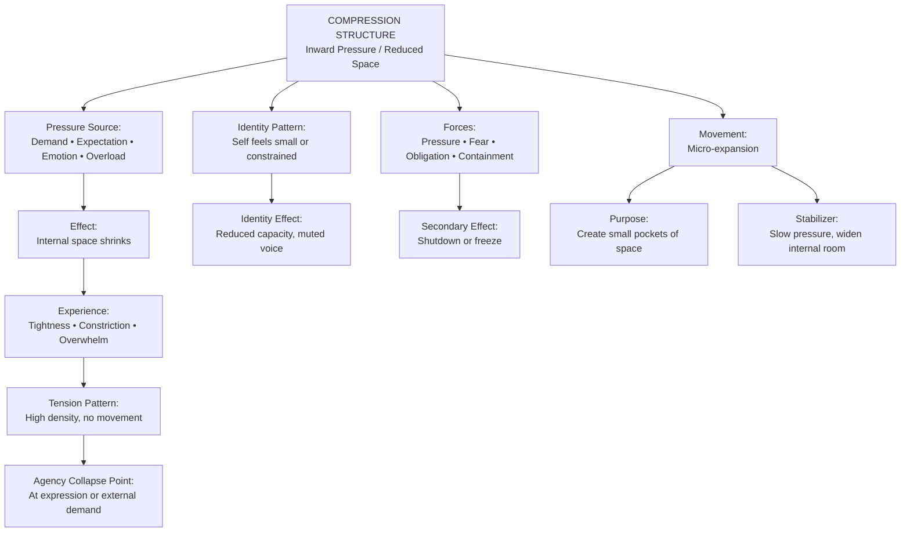

# **Case Study 6: ISS + V.I.T.A.L. Applied to a Compression Structure**  
*A therapist works with a client experiencing internal pressure buildup and emotional compaction.*

---

## **Client Snapshot**
**Client:** “Dana,” 52, high‑level operations executive  
**Presenting Issue:** Chronic tension, irritability, and emotional tightness; difficulty expressing needs  
**Underlying Structure:** Compression — internal forces pushing inward, reducing emotional space  
**Therapeutic Goal:** Increase structural awareness, identify compression sources, and create decompression pathways

---

# **Part 1 — ISS in Action**

## **1. ISS Entry Point**
Therapist:

> “What feels most alive or charged for you right now?”

**Client Response:**  
“I feel like everything is pressing in on me. Work, family, expectations — it’s all squeezing me. I don’t have room to breathe.”

**Clinician Note:**  
The “alive” material is the **pressure** — not the responsibilities.

---

## **2. Surface the Structure**
Therapist:

> “If you look at this as a structure, what shape does it have?”

**Client:**  
“It’s like a vise. Everything is tightening around me. I’m getting smaller inside it.”

**Clinician Note:**  
Structure identified: **Compression**  
- Inward pressure  
- Reduced internal space  
- Emotional compaction  
- No collapse, no fragmentation — just tightening

---

## **3. Identify Forces**
Therapist:

> “What forces are acting inside this compression?”

**Client Identifies:**  
- High work demands  
- Family expectations  
- Internal perfectionism  
- Fear of disappointing others  
- Habit of self‑containment  
- Lack of emotional release

**Clinician Note:**  
Forces push inward from multiple directions.

---

## **4. Locate Position**
Therapist:

> “Where are you inside this structure?”

**Client:**  
“I’m in the center, getting squeezed. I can’t expand. I can’t push back.”

**Clinician Note:**  
Client is positioned **at the core** of the compression.

---

## **5. Define Movement**
Therapist:

> “Not a solution — just movement. What would a shift look like?”

**Client:**  
“Maybe creating a little space. Even a crack. Something that lets pressure out.”

**Clinician Note:**  
Movement = **micro‑expansion**, not release or resolution.

---

# **Part 2 — Applying V.I.T.A.L.**

## **V — Viewpoint**
**Client Viewpoint:** First‑person immersed  
**Shift:** Therapist invites meta‑view:

> “If you observe the compression from above, what do you see?”

**Client:**  
“That I’m holding everything in. I’m not letting anything out.”

---

## **I — Identity**
Therapist:

> “Which identities are activated?”

**Client:**  
“The responsible one. The strong one. The one who never asks for help.”

**Clinician Note:**  
Identity rigidity contributes to compression.

---

## **T — Tension**
**Tensions Identified:**  
- Internal: responsibility vs. capacity  
- Interpersonal: expectations vs. boundaries  
- Structural: inward pressure  
- Emotional: containment vs. expression

**Clinician Note:**  
Compression structures have **high tension density**, not high tension polarity.

---

## **A — Agency**
Therapist:

> “Where do you feel agency? Where does it collapse?”

**Client:**  
“I feel agency when planning. I lose it when I need to express anything.”

**Clinician Note:**  
Agency collapses at the **moment of emotional expression**.

---

## **L — Landscape**
Client maps the broader landscape:  
- High-pressure executive environment  
- Family reliance on client’s stability  
- Cultural norms around stoicism  
- Chronic stress  
- Limited emotional outlets  
- Social expectations to “hold it together”

**Clinician Note:**  
Landscape reveals systemic reinforcement of compression.

---

# **Part 3 — Integration**

Therapist:

> “What do you see now that you couldn’t see at the beginning?”

**Client:**  
“That I’m not overwhelmed because things are too big. I’m overwhelmed because everything is pressing inward and I’m not letting anything out.”

---

## **Clinical Insight**
Therapist reflects:  
- Compression is structural, not emotional weakness  
- Identity rigidity intensifies inward pressure  
- Agency collapses at expression points  
- Movement must focus on **micro‑expansion**, not catharsis  
- V.I.T.A.L. reveals how tension density forms and why it persists

---

## **Practice Adjustment**
Therapist plans to:  
- Identify micro‑expansion opportunities  
- Introduce small emotional release practices  
- Explore identity flexibility  
- Use ISS to track pressure points  
- Use V.I.T.A.L. to map tension density and identity rigidity  
- Introduce decompression rituals between high-pressure events

---

# **Part 4 — Training Notes for Clinicians**

### **Why this case is effective for training**
- Demonstrates ISS with a **compression structure**, distinct from loops, push–pull, collapse, gaps, and fragmentation  
- Shows how inward pressure can be structural  
- Highlights identity rigidity as a driver of compression  
- Models how movement is defined as micro‑expansion  
- Shows V.I.T.A.L. clarifying tension density and agency collapse

### **How to use this in training**
- Have clinicians map compression visually (vise metaphor)  
- Ask them to identify pressure sources  
- Have them run ISS prompts on their own compression patterns  
- Compare their own identity rigidity with the client’s  
- Discuss how viewpoint shifts create decompression opportunities

---

Here’s a clean, structural **Mermaid diagram of the Compression Structure** — showing how ISS models inward pressure, reduced emotional space, agency collapse, and movement.

You can paste this directly into VS Code, Obsidian, or any Mermaid-enabled environment.

---

## **Mermaid Diagram — Compression Structure (ISS)**

---

## **How to read this diagram**
- **Compression** is inward pressure that reduces emotional or cognitive space.  
- The person feels **tight**, constrained, or overloaded.  
- **Tension is dense**, not chaotic — everything is squeezed inward.  
- **Agency collapses** when asked to express, act, or respond.  
- Identity feels **small**, muted, or constrained.  
- Movement is **micro‑expansion** — creating tiny pockets of space to reduce pressure.

Compression is not pathology — it’s a **structure** describing how experience behaves under inward force.

---
