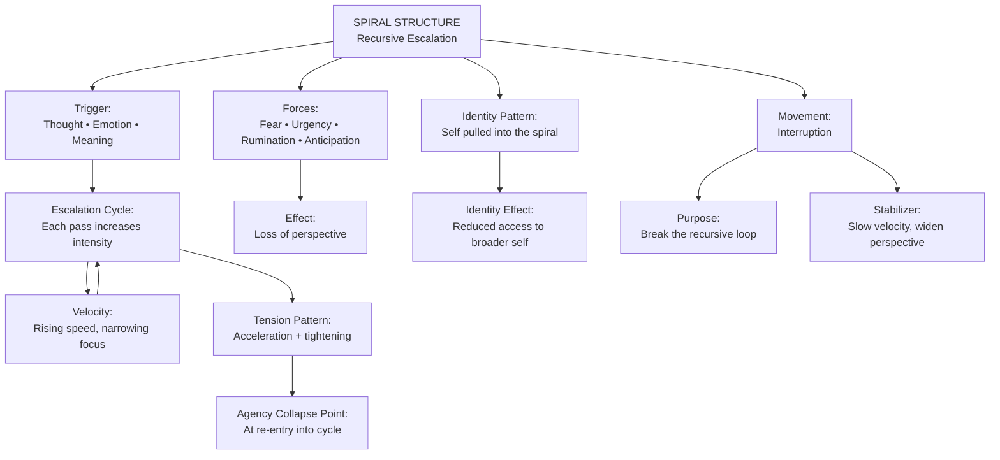
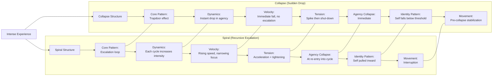

# **Case Study 7: ISS + V.I.T.A.L. Applied to a Spiral Structure**  
*A therapist works with a client experiencing escalating cycles of worry and reassurance-seeking.*

---

## **Client Snapshot**
**Client:** “Leah,” 27, elementary school teacher  
**Presenting Issue:** Recurrent cycles of worry that intensify over time, leading to reassurance-seeking and emotional exhaustion  
**Underlying Structure:** Spiral — repeated return to the same issue with increasing intensity  
**Therapeutic Goal:** Increase structural awareness, identify spiral triggers, and interrupt escalation points

---

# **Part 1 — ISS in Action**

## **1. ISS Entry Point**
Therapist:

> “What feels most alive or charged for you right now?”

**Client Response:**  
“I keep worrying about whether I’m doing enough at work. I calm down for a bit, but then the worry comes back stronger. It’s like each time it returns, it’s bigger.”

**Clinician Note:**  
The “alive” material is the **returning and intensifying cycle** — not the content of the worry.

---

## **2. Surface the Structure**
Therapist:

> “If you look at this as a structure, what shape does it have?”

**Client:**  
“It’s like a spiral. I go around the same issue again and again, but each time I’m deeper in it.”

**Clinician Note:**  
Structure identified: **Spiral**  
- Recurrent cycle  
- Increasing intensity  
- Narrowing emotional space  
- Escalation over time

---

## **3. Identify Forces**
Therapist:

> “What forces are acting inside this spiral?”

**Client Identifies:**  
- Fear of failure  
- Desire to be a good teacher  
- Internalized pressure to be perfect  
- Anxiety about disappointing students  
- Habit of reassurance-seeking  
- Social comparison with colleagues

**Clinician Note:**  
Forces amplify each cycle, tightening the spiral.

---

## **4. Locate Position**
Therapist:

> “Where are you inside this structure?”

**Client:**  
“I’m in the middle, being pulled downward. Each time I think I’m out, I get sucked back in.”

**Clinician Note:**  
Client is positioned **inside the spiral**, not outside observing it.

---

## **5. Define Movement**
Therapist:

> “Not a solution — just movement. What would a shift look like?”

**Client:**  
“Maybe stepping out of the spiral for a moment. Or slowing it down.”

**Clinician Note:**  
Movement = **interrupting escalation**, not eliminating worry.

---

# **Part 2 — Applying V.I.T.A.L.**

## **V — Viewpoint**
**Client Viewpoint:** First‑person immersed  
**Shift:** Therapist invites meta‑view:

> “If you observe the spiral from above, what do you see?”

**Client:**  
“That I’m repeating the same pattern. The content changes, but the structure is the same.”

---

## **I — Identity**
Therapist:

> “Which identities are activated?”

**Client:**  
“The caring teacher. The anxious perfectionist. The scared beginner.”

**Clinician Note:**  
Identity layering contributes to spiral intensification.

---

## **T — Tension**
**Tensions Identified:**  
- Internal: care vs. fear  
- Interpersonal: expectations vs. self‑judgment  
- Structural: tightening cycles  
- Emotional: reassurance vs. doubt

**Clinician Note:**  
Spiral structures have **recursive tension**, not static tension.

---

## **A — Agency**
Therapist:

> “Where do you feel agency? Where does it collapse?”

**Client:**  
“I feel agency right after I get reassurance. Then it collapses when the worry comes back.”

**Clinician Note:**  
Agency collapses at the **moment of spiral re‑entry**.

---

## **L — Landscape**
Client maps the broader landscape:  
- High-pressure school environment  
- Social comparison among teachers  
- Childhood history of needing external validation  
- Limited emotional recovery time  
- Cultural norms around self-sacrifice in teaching  
- Chronic stress

**Clinician Note:**  
Landscape reveals systemic reinforcement of spiral dynamics.

---

# **Part 3 — Integration**

Therapist:

> “What do you see now that you couldn’t see at the beginning?”

**Client:**  
“That the problem isn’t the worry itself. It’s the spiral — the way it keeps tightening and pulling me back.”

---

## **Clinical Insight**
Therapist reflects:  
- Spiral is structural, not emotional weakness  
- Identity layering intensifies cycles  
- Agency collapses at re‑entry points  
- Movement must focus on **interrupting escalation**, not eliminating worry  
- V.I.T.A.L. reveals how recursive tension forms and why it persists

---

## **Practice Adjustment**
Therapist plans to:  
- Identify spiral entry and re‑entry points  
- Introduce micro‑interruptions (breathing, grounding, reframing)  
- Strengthen identity coherence  
- Reduce reliance on reassurance  
- Use ISS to track spiral tightening  
- Use V.I.T.A.L. to map identity layering and tension recursion  
- Introduce decompression rituals after high-intensity cycles

---

# **Part 4 — Training Notes for Clinicians**

### **Why this case is effective for training**
- Demonstrates ISS with a **spiral structure**, distinct from loops, push–pull, collapse, gaps, fragmentation, and compression  
- Shows how escalation can be structural  
- Highlights identity layering as a driver of spiral tightening  
- Models how movement is defined as interruption, not resolution  
- Shows V.I.T.A.L. clarifying recursive tension and agency collapse

### **How to use this in training**
- Have clinicians map the spiral visually (tightening coil metaphor)  
- Ask them to identify re‑entry points  
- Have them run ISS prompts on their own spiral patterns  
- Compare their own identity layering with the client’s  
- Discuss how viewpoint shifts reduce spiral intensity

---

Here’s a clean, structural **Mermaid diagram of the Spiral Structure** — showing how ISS models recursive escalation, rising velocity, agency collapse, and movement.

You can paste this directly into VS Code, Obsidian, or any Mermaid-enabled environment.

---

## **Mermaid Diagram — Spiral Structure (ISS)**

---

## **How to read this diagram**

- **Spiral** is a recursive loop — each pass increases intensity.  
- The person feels **pulled inward**, losing perspective.  
- **Velocity rises**, narrowing attention and amplifying emotion or thought.  
- **Agency collapses** when the person re-enters the cycle (the moment the loop restarts).  
- Identity becomes **captured** by the spiral, losing access to broader self-resources.  
- Movement is **interruption** — breaking the loop before velocity spikes.

Spiral is not pathology — it’s a **structure** describing how experience behaves when recursive escalation takes over.

---

## **Spiral vs. Collapse** comparison  

Here’s a clear, structural **Mermaid diagram comparing Spiral vs. Collapse** — two ISS patterns that can feel intense but behave very differently inside experience.  
This is non‑clinical, non‑diagnostic, and purely architectural.

You can paste this directly into VS Code, Obsidian, or any Mermaid-enabled environment.

---

## **Mermaid Diagram — Spiral vs. Collapse (ISS Structural Comparison)**

---

## **How to read this diagram**

### **Spiral**
- Experience escalates **recursively**.  
- Each loop increases intensity.  
- Velocity rises — attention narrows.  
- Tension is acceleration + tightening.  
- Agency collapses when the person **re-enters the loop**.  
- Identity feels pulled inward.  
- Movement is **interruption** — breaking the cycle.

### **Collapse**
- Experience drops suddenly — the “trapdoor.”  
- No escalation; it’s immediate.  
- Velocity is a **fall**, not a rise.  
- Tension spikes, then shuts down.  
- Agency collapses **instantly**.  
- Identity falls below a threshold (“I can’t”).  
- Movement is **pre‑collapse stabilization** — slowing the drop before it happens.

---

