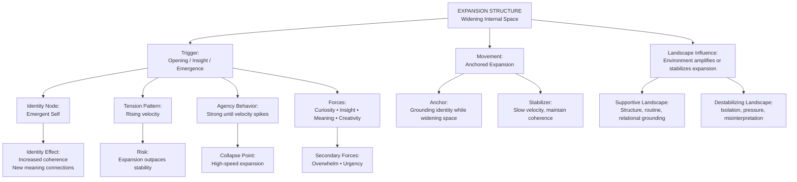
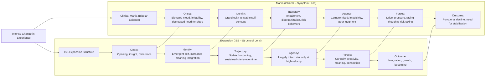

# **Case Study 8: ISS + V.I.T.A.L. Applied to an Expansion Structure**  
*A therapist works with a client experiencing rapid internal growth and widening identity space.*

---

## **Client Snapshot**
**Client:** “Nadia,” 34, UX designer  
**Presenting Issue:** Sudden increase in creative energy, new ideas, and desire for change; difficulty managing the emotional intensity of growth  
**Underlying Structure:** Expansion — widening internal space, increasing possibilities, rising energy  
**Therapeutic Goal:** Increase structural awareness, identify expansion drivers, and stabilize growth without losing coherence

---

# **Part 1 — ISS in Action**

## **1. ISS Entry Point**
Therapist:

> “What feels most alive or charged for you right now?”

**Client Response:**  
“I feel like everything is opening up. I have new ideas, new interests, new confidence. It’s exciting but also overwhelming — like I’m expanding faster than I can keep up.”

**Clinician Note:**  
The “alive” material is the **opening**, the widening, the expansion — not the ideas themselves.

---

## **2. Surface the Structure**
Therapist:

> “If you look at this as a structure, what shape does it have?”

**Client:**  
“It feels like a balloon inflating. There’s more space, more energy, more possibility.”

**Clinician Note:**  
Structure identified: **Expansion**  
- Outward movement  
- Increasing internal space  
- Rising energy  
- Potential instability if expansion outpaces coherence

---

## **3. Identify Forces**
Therapist:

> “What forces are acting inside this expansion?”

**Client Identifies:**  
- Renewed creative drive  
- Desire for autonomy  
- Recent positive feedback at work  
- New social connections  
- Internal permission to explore  
- Emotional excitement

**Clinician Note:**  
Forces push outward, increasing internal volume.

---

## **4. Locate Position**
Therapist:

> “Where are you inside this structure?”

**Client:**  
“I’m in the middle, being pulled outward. It’s thrilling but also disorienting.”

**Clinician Note:**  
Client is positioned **at the center of expansion**, experiencing both excitement and instability.

---

## **5. Define Movement**
Therapist:

> “Not a solution — just movement. What would a shift look like?”

**Client:**  
“Maybe grounding myself while still expanding. Like growing roots as I grow branches.”

**Clinician Note:**  
Movement = **anchored expansion**, not contraction or acceleration.

---

# **Part 2 — Applying V.I.T.A.L.**

## **V — Viewpoint**
**Client Viewpoint:** First‑person immersed  
**Shift:** Therapist invites meta‑view:

> “If you observe the expansion from above, what do you see?”

**Client:**  
“That I’m opening faster than I’m stabilizing. I need structure to support the growth.”

---

## **I — Identity**
Therapist:

> “Which identities are activated?”

**Client:**  
“The creative one. The confident one. The explorer. The part of me that wants change.”

**Clinician Note:**  
Identity expansion is occurring — new identity nodes emerging.

---

## **T — Tension**
**Tensions Identified:**  
- Internal: excitement vs. overwhelm  
- Interpersonal: autonomy vs. relational expectations  
- Structural: outward movement vs. stability  
- Emotional: possibility vs. fear of losing control

**Clinician Note:**  
Expansion structures have **low tension initially**, but tension increases as expansion accelerates.

---

## **A — Agency**
Therapist:

> “Where do you feel agency? Where does it collapse?”

**Client:**  
“I feel agency when exploring new ideas. I lose it when everything expands at once.”

**Clinician Note:**  
Agency collapses at **high expansion velocity**.

---

## **L — Landscape**
Client maps the broader landscape:  
- Supportive work environment  
- Recent personal breakthroughs  
- New friendships encouraging exploration  
- Reduced external constraints  
- Increased emotional bandwidth  
- Lack of grounding routines

**Clinician Note:**  
Landscape reveals environmental factors amplifying expansion.

---

# **Part 3 — Integration**

Therapist:

> “What do you see now that you couldn’t see at the beginning?”

**Client:**  
“That the excitement isn’t the problem. The speed is. I need to expand in a way that doesn’t destabilize me.”

---

## **Clinical Insight**
Therapist reflects:  
- Expansion is structural, not impulsive  
- Identity growth is outpacing identity coherence  
- Agency collapses when expansion velocity exceeds stability  
- Movement must focus on **anchored expansion**, not slowing growth  
- V.I.T.A.L. reveals how identity nodes emerge and why coherence matters

---

## **Practice Adjustment**
Therapist plans to:  
- Introduce grounding practices during expansion  
- Strengthen identity coherence  
- Identify expansion accelerators  
- Use ISS to track expansion velocity  
- Use V.I.T.A.L. to map identity emergence and tension points  
- Introduce rituals that stabilize growth without constraining it

---

# **Part 4 — Training Notes for Clinicians**

### **Why this case is effective for training**
- Demonstrates ISS with an **expansion structure**, distinct from loops, push–pull, collapse, gaps, fragmentation, compression, and spirals  
- Shows how growth can be structural  
- Highlights identity emergence as a driver of expansion  
- Models how movement is defined as anchored expansion  
- Shows V.I.T.A.L. clarifying identity growth, tension emergence, and agency collapse

### **How to use this in training**
- Have clinicians map expansion visually (balloon or outward radiating lines)  
- Ask them to identify expansion accelerators  
- Have them run ISS prompts on their own expansion moments  
- Compare their own identity emergence with the client’s  
- Discuss how viewpoint shifts stabilize expansion

---

## **Mermaid Diagram — Expansion Structure (ISS)**

---

## **How to read this diagram**
- **Expansion begins with an opening** — insight, meaning, creativity, coherence.  
- **Identity shifts** toward an emergent, more coherent self.  
- **Tension rises** as velocity increases.  
- **Agency is strong** until expansion becomes too fast.  
- **Movement is “anchored expansion”** — widening internal space while stabilizing identity.  
- **Landscape matters** — supportive environments stabilize expansion; pressured ones destabilize it.

---

## **Mermaid Diagram — Comparing Expansion vs. Mania**

