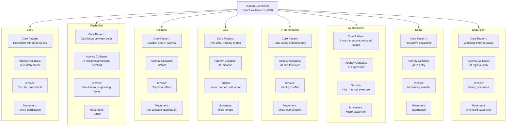

# **ISS + V.I.T.A.L. Structural Atlas**  
### *A unified reference summarizing eight core structural architectures in clinical practice*

---

## **Overview**
This atlas distills eight structural patterns that commonly appear in therapy. Each structure includes:

- Core definition  
- Structural signature  
- Typical client presentation  
- ISS entry point  
- V.I.T.A.L. dimensional highlights  
- Movement type  
- Clinical leverage points  

The goal is to help clinicians **recognize structure quickly**, **map forces precisely**, and **apply ISS + V.I.T.A.L. with clarity and confidence**.

---

# **1. Loop Structure**  
### *Repetition without progress*

**Signature:**  
Circular pattern → same behavior → same outcome → same reinforcement.

**Client Presentation:**  
“I keep doing this over and over.”

**ISS Insight:**  
Identify the loop engine (reinforcing forces).

**V.I.T.A.L. Highlights:**  
- Identity: role entanglement  
- Tension: predictable cycle  
- Agency: collapses at reinforcement point  

**Movement:**  
Micro‑permission to disrupt the loop.

**Clinical Leverage:**  
Track loop nodes; intervene at predictable collapse points.

---

# **2. Push–Pull Structure**  
### *Ambivalence with oscillation*

**Signature:**  
Two poles → client moves toward one → then away → repeated oscillation.

**Client Presentation:**  
“I want it… but I don’t.”

**ISS Insight:**  
Map poles and forces driving oscillation.

**V.I.T.A.L. Highlights:**  
- Identity: competing identity poles  
- Tension: relational or internal polarity  
- Agency: collapses at intimacy or autonomy moments  

**Movement:**  
Pause inside the oscillation.

**Clinical Leverage:**  
Stabilize the middle space; reduce polarity intensity.

---

# **3. Collapse Structure**  
### *Sudden loss of coherence*

**Signature:**  
Trapdoor → rapid drop → loss of agency, clarity, or identity stability.

**Client Presentation:**  
“I freeze. Everything disappears.”

**ISS Insight:**  
Identify pre‑collapse cues and triggers.

**V.I.T.A.L. Highlights:**  
- Identity: regression  
- Tension: spike at evaluation moments  
- Agency: collapses instantly  

**Movement:**  
Pre‑collapse stabilization.

**Clinical Leverage:**  
Strengthen identity coherence; intervene before the drop.

---

# **4. Gap Structure**  
### *Missing connection between two internal poles*

**Signature:**  
Two cliffs → no bridge → absence rather than conflict.

**Client Presentation:**  
“I want to… but I never start.”

**ISS Insight:**  
Identify the nature of the missing bridge.

**V.I.T.A.L. Highlights:**  
- Identity: aspirational vs. current  
- Tension: latent, not visible  
- Agency: collapses at initiation  

**Movement:**  
Micro‑connection (tiny bridge).

**Clinical Leverage:**  
Build scaffolding; reduce perfectionistic barriers.

---

# **5. Fragmentation Structure**  
### *Parts acting independently without coherence*

**Signature:**  
Multiple internal nodes → no communication → sudden shifts in control.

**Client Presentation:**  
“Different versions of me keep taking over.”

**ISS Insight:**  
Identify parts, roles, and agendas.

**V.I.T.A.L. Highlights:**  
- Identity: multiple nodes  
- Tension: multi‑directional  
- Agency: part‑dependent  

**Movement:**  
Micro‑coordination between parts.

**Clinical Leverage:**  
Strengthen observer position; build communication pathways.

---

# **6. Compression Structure**  
### *Inward pressure reducing emotional space*

**Signature:**  
Vise → tightening → compaction → reduced internal volume.

**Client Presentation:**  
“I’m holding too much. Everything is pressing inward.”

**ISS Insight:**  
Identify pressure sources and density.

**V.I.T.A.L. Highlights:**  
- Identity: rigidity  
- Tension: high density  
- Agency: collapses at expression  

**Movement:**  
Micro‑expansion.

**Clinical Leverage:**  
Introduce decompression rituals; loosen identity rigidity.

---

# **7. Spiral Structure**  
### *Recurrent escalation over time*

**Signature:**  
Cycle → return → intensification → narrowing emotional space.

**Client Presentation:**  
“It keeps coming back stronger.”

**ISS Insight:**  
Identify re‑entry points and escalation triggers.

**V.I.T.A.L. Highlights:**  
- Identity: layering  
- Tension: recursive  
- Agency: collapses at re‑entry  

**Movement:**  
Interrupt escalation.

**Clinical Leverage:**  
Slow spiral velocity; reduce reassurance loops.

---

# **8. Expansion Structure**  
### *Outward growth and widening internal space*

**Signature:**  
Balloon → increasing volume → rising energy → potential instability.

**Client Presentation:**  
“Everything is opening up — fast.”

**ISS Insight:**  
Track expansion velocity and coherence.

**V.I.T.A.L. Highlights:**  
- Identity: emergence  
- Tension: increases with speed  
- Agency: collapses when expansion outpaces stability  

**Movement:**  
Anchored expansion.

**Clinical Leverage:**  
Ground growth; stabilize identity while expanding.

---

# **Cross‑Structure Comparison Table**

| Structure | Movement Type | Agency Collapse Point | Identity Pattern | Tension Type | Clinical Priority |
|----------|----------------|------------------------|------------------|--------------|-------------------|
| Loop | Micro‑permission | Reinforcement moment | Role entanglement | Predictable | Disrupt loop node |
| Push–Pull | Pause | Intimacy/autonomy | Polarity | Binary | Stabilize middle space |
| Collapse | Pre‑collapse stabilization | Evaluation moment | Regression | Spike | Catch pre‑collapse cues |
| Gap | Micro‑connection | Initiation | Split (future vs. present) | Latent | Build bridges |
| Fragmentation | Micro‑coordination | Part takeover | Multiple nodes | Multi‑directional | Strengthen observer |
| Compression | Micro‑expansion | Expression | Rigidity | Dense | Decompress pressure |
| Spiral | Interruption | Re‑entry | Layering | Recursive | Slow escalation |
| Expansion | Anchored expansion | High velocity | Emergence | Rising | Ground growth |

---

# **How Clinicians Use This Atlas**
- **Structural diagnosis:** Identify the architecture before exploring content.  
- **Treatment planning:** Tailor interventions to structure, not symptoms.  
- **Identity mapping:** Track identity nodes, splits, regressions, or emergences.  
- **Agency tracking:** Identify collapse points and strengthen pre‑collapse agency.  
- **Movement definition:** Use structure‑specific movement types (micro‑permission, pause, micro‑bridge, etc.).  
- **Training clinicians:** Teach structure recognition as a core therapeutic skill.

---

```mermaid

flowchart TD

    %% CENTRAL NODE
    CORE["ISS + V.I.T.A.L.<br/>Structural Atlas"]

    %% EIGHT STRUCTURES
    LOOP["Loop<br/>(Repetition without progress)"]
    PUSHPULL["Push–Pull<br/>(Ambivalence with oscillation)"]
    COLLAPSE["Collapse<br/>(Sudden loss of coherence)"]
    GAP["Gap<br/>(Missing bridge between poles)"]
    FRAG["Fragmentation<br/>(Parts without coordination)"]
    COMP["Compression<br/>(Inward pressure, reduced space)"]
    SPIRAL["Spiral<br/>(Recurrent escalation over time)"]
    EXP["Expansion<br/>(Widening space, rising energy)"]

    CORE --> LOOP
    CORE --> PUSHPULL
    CORE --> COLLAPSE
    CORE --> GAP
    CORE --> FRAG
    CORE --> COMP
    CORE --> SPIRAL
    CORE --> EXP

    %% LOOP DETAIL
    subgraph S1["Loop Structure"]
        L1["Engine:<br/>Reinforcing cycle"]
        L2["Agency collapse:<br/>At reinforcement node"]
        L3["Movement:<br/>Micro‑permission to disrupt"]
        LOOP --> L1 --> L2 --> L3
    end

    %% PUSH–PULL DETAIL
    subgraph S2["Push–Pull Structure"]
        PP1["Poles:<br/>Intimacy ↔ Autonomy"]
        PP2["Agency collapse:<br/>At relational moment"]
        PP3["Movement:<br/>Pause in oscillation"]
        PUSHPULL --> PP1 --> PP2 --> PP3
    end

    %% COLLAPSE DETAIL
    subgraph S3["Collapse Structure"]
        C1["Shape:<br/>Trapdoor / drop"]
        C2["Agency collapse:<br/>Instant at trigger"]
        C3["Movement:<br/>Pre‑collapse stabilization"]
        COLLAPSE --> C1 --> C2 --> C3
    end

    %% GAP DETAIL
    subgraph S4["Gap Structure"]
        G1["Poles:<br/>Desire ↔ Action"]
        G2["Agency collapse:<br/>At initiation"]
        G3["Movement:<br/>Micro‑bridge / tiny step"]
        GAP --> G1 --> G2 --> G3
    end

    %% FRAGMENTATION DETAIL
    subgraph S5["Fragmentation Structure"]
        F1["Nodes:<br/>Multiple parts"]
        F2["Agency:<br/>Part‑dependent"]
        F3["Movement:<br/>Micro‑coordination between parts"]
        FRAG --> F1 --> F2 --> F3
    end

    %% COMPRESSION DETAIL
    subgraph S6["Compression Structure"]
        CP1["Shape:<br/>Vise / inward pressure"]
        CP2["Agency collapse:<br/>At expression"]
        CP3["Movement:<br/>Micro‑expansion / small release"]
        COMP --> CP1 --> CP2 --> CP3
    end

    %% SPIRAL DETAIL
    subgraph S7["Spiral Structure"]
        S1a["Pattern:<br/>Recurrent, tightening cycles"]
        S2a["Agency collapse:<br/>At re‑entry"]
        S3a["Movement:<br/>Interrupt escalation"]
        SPIRAL --> S1a --> S2a --> S3a
    end

    %% EXPANSION DETAIL
    subgraph S8["Expansion Structure"]
        E1["Shape:<br/>Balloon / outward growth"]
        E2["Agency collapse:<br/>At high velocity"]
        E3["Movement:<br/>Anchored expansion"]
        EXP --> E1 --> E2 --> E3
    end

```

Here is a **Mermaid diagram comparing all 8 ISS structures** — clean, structural, and designed for fast visual differentiation.  
This is non‑clinical, non‑diagnostic, and purely architectural.

You can paste this directly into VS Code, Obsidian, or any Mermaid-enabled environment.

---

## **Mermaid Diagram — All 8 ISS Structures (Comparative Map)**

---

## **How to read this diagram**
This map shows the **full architecture** of ISS:

- **Loop** → repetition  
- **Push–Pull** → oscillation  
- **Collapse** → sudden drop  
- **Gap** → missing bridge  
- **Fragmentation** → parts  
- **Compression** → inward pressure  
- **Spiral** → escalation  
- **Expansion** → widening  

Each structure includes:
- **Core Pattern** (the shape)  
- **Agency Collapse Point** (where choice disappears)  
- **Tension Pattern** (how pressure behaves)  
- **Movement Type** (the structural intervention)

This is the entire ISS structural atlas in one diagram.

---

