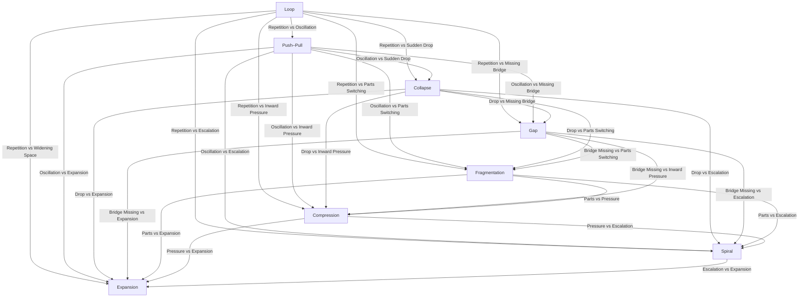

A **full cross‑matrix of all 8 ISS structures**. 

This is not a *table of content*, but a *structural atlas* — showing how each pattern interacts with the others.

---

# **Mermaid Diagram — Full ISS Cross‑Matrix (All 8 Structures)**  
### *Every structure compared to every other structure*

---

# **How to read this matrix**
This diagram shows **every structure compared to every other structure**, with each edge labeled by the *core contrast* between the two patterns.

### **Example contrasts**
- **Loop vs Push–Pull** → repetition vs oscillation  
- **Gap vs Collapse** → missing bridge vs sudden drop  
- **Compression vs Expansion** → inward pressure vs widening space  
- **Fragmentation vs Spiral** → parts switching vs recursive escalation  

This is the **full ISS structural atlas** in one diagram.

---

# **Why this matrix is powerful**
It allows you to analyze:

### **1. Structural interactions**
How one pattern behaves when paired with another.

### **2. Relational dynamics**
What happens when two people inhabit different structures.

### **3. Social amplification**
Which structures intensify under pressure, isolation, demand, or relational load.

### **4. Movement compatibility**
Which movements stabilize or destabilize each structure pairing.

### **5. V.I.T.A.L. overlays**
How each structure expresses across:
- **Vantage**  
- **Identity**  
- **Tension**  
- **Agency**  
- **Landscape**

This matrix becomes the backbone of a **full ISS modeling system**.

---

# **Dynamic V.I.T.A.L. Dimensional Cross‑Matrix (Full Grid Table)**

### **Legend**
- **Vantage** = how perspective *moves*  
- **Identity** = how self *reorganizes*  
- **Tension** = how pressure *behaves*  
- **Agency** = how choice *appears/collapses*  
- **Landscape** = how environment *amplifies/stabilizes*  

---

## **Full Grid Table**

| **ISS Structure** | **Dynamic Vantage** | **Dynamic Identity** | **Dynamic Tension** | **Dynamic Agency** | **Dynamic Landscape** |
|-------------------|----------------------|------------------------|----------------------|----------------------|------------------------|
| **Loop** | Perspective narrows with each repetition | Self contracts into predictable pattern | Circular buildup with no release | Choice fades as repetition reinforces itself | Routine + isolation accelerate looping |
| **Push–Pull** | Perspective flips between poles | Self oscillates; unstable coherence | Opposing forces rise/fall rhythmically | Choice collapses at relational pressure | Demand amplifies oscillation; safety stabilizes |
| **Collapse** | Perspective drops suddenly below threshold | Self contracts sharply; capability disappears | Instant spike → immediate shutdown | Choice disappears instantly; returns slowly | Scrutiny + pressure trigger collapse trajectory |
| **Gap** | Future-self expands; present-self stalls | Self splits between vision and capacity | Latent → spikes at initiation | Choice collapses at first step; returns via micro‑bridge | Uncertainty widens gap; support narrows it |
| **Fragmentation** | Perspective shifts with each part activation | Self reorganizes into competing parts | Conflict rises as parts compete | Choice collapses when a part takes over | Isolation increases switching; coordination stabilizes |
| **Compression** | Perspective tightens as internal space shrinks | Self compresses; expressive range narrows | Pressure densifies inwardly | Choice collapses at expression/demand | Pressure intensifies compression; support expands space |
| **Spiral** | Perspective narrows as velocity increases | Self pulled inward; loses broader access | Escalates recursively with each cycle | Choice collapses at re‑entry into loop | Uncertainty accelerates spiral; grounding interrupts |
| **Expansion** | Perspective widens; possibility increases | Self grows; reorganizes into larger coherence | Openness rises; velocity increases | Choice collapses at high velocity; returns with anchoring | Support stabilizes widening; demand destabilizes |

---

# **How to use this grid**

### **1. As a diagnostic map**
You can identify a structure by checking:
- vantage movement  
- identity behavior  
- tension shape  
- agency collapse point  
- landscape sensitivity  

### **2. As a modeling foundation**
This grid is the backbone for:
- relational V.I.T.A.L.  
- social V.I.T.A.L.  
- movement V.I.T.A.L.  
- predictive V.I.T.A.L.  

### **3. As a teaching tool**
This is the simplest way to show how ISS and V.I.T.A.L. interlock.

### **4. As a structural grammar**
This grid is essentially the **periodic table of ISS**.

---

