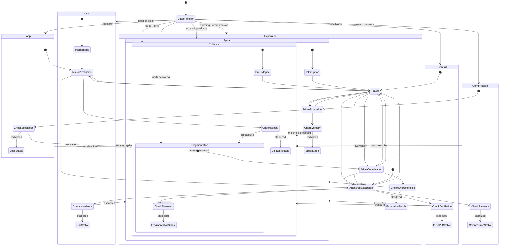
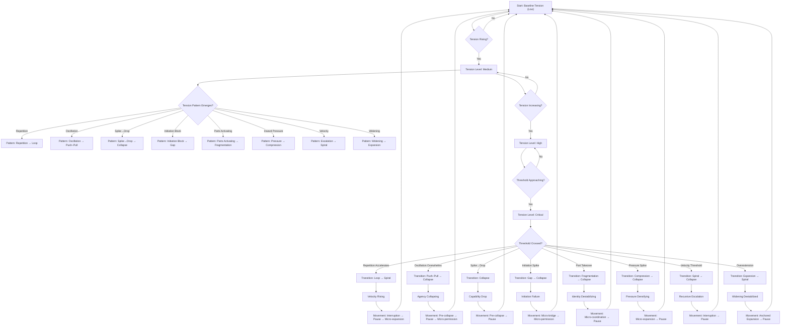

A **dynamic sequencing simulator** you can actually *run in your head or on paper*—a step‑by‑step engine that evolves tension, structure, movement, and landscape over time.

Think of it as:  
**State → Detect → Move → Update → Repeat.**

---

### 1. Core state variables

At any “tick” in the simulation, you track:

- **Structure:** Loop, Push–Pull, Collapse, Gap, Fragmentation, Compression, Spiral, Expansion  
- **Tension level:** Low / Medium / High / Critical  
- **Tension pattern:** Repetition, Oscillation, Spike→Drop, Initiation block, Parts, Pressure, Velocity, Widening  
- **Landscape:** Pressure, Isolation, Support, Demand, Scrutiny, Uncertainty, Overwhelm  
- **Agency:** Available / Narrowed / Collapsing / Absent  

You can literally write this as a row in a table for each time step.

---

### 2. Simulation loop (the engine)

For each step:

1. **Read current state**  
   - Structure  
   - Tension level + pattern  
   - Landscape  
   - Agency  

2. **Detect pattern → choose sequence**  
   - Use the **movement sequencing flowchart**:  
     - repetition → Loop sequence  
     - oscillation → Push–Pull sequence  
     - spike→drop → Collapse sequence  
     - initiation block → Gap sequence  
     - parts → Fragmentation sequence  
     - pressure → Compression sequence  
     - velocity → Spiral sequence  
     - widening → Expansion sequence  

3. **Apply movement chain (one “tick” per movement)**  
   For the chosen structure, run:
   - **Primary movement**  
   - If tension not reduced → **Secondary movement**  
   - If still unstable → **Tertiary movement**

4. **Update state**  
   After each movement, update:
   - **Tension level** (up, down, same)  
   - **Structure** (stays or transitions, using the predictive transition grid)  
   - **Agency** (more, less, same)  
   - **Landscape impact** (pressure up/down, support up/down, etc.)

5. **Check escalation / collapse conditions**  
   - If velocity ↑ and narrowing → switch to **Spiral protocol**  
   - If spike→drop and capability ↓ → switch to **Collapse protocol**  
   - If widening stabilizes → move toward **Expansion sequences**

6. **Repeat**  
   Each iteration is one “moment” in the simulation.

---

### 3. Example simulation (short run)

Let’s walk a quick sequence:

**Step 0 — Initial state**  
- Structure: **Loop**  
- Tension: Medium  
- Pattern: Repetition  
- Landscape: Mild isolation, mild pressure  
- Agency: Narrowed  

**Step 1 — Detect & move**  
- Pattern → Loop  
- Apply **Micro‑permission**  
- Result: small deviation appears, tension slightly ↓, agency slightly ↑  

**Step 2 — Update & re‑evaluate**  
- Structure: still Loop, but less rigid  
- Tension: Low–Medium  
- Landscape: unchanged  
- Apply **Pause**  
- Result: repetition slows, tension ↓, agency ↑  

**Step 3 — Apply tertiary movement**  
- Apply **Micro‑expansion**  
- Result: more space, vantage widens, tension ↓ further  

**Step 4 — Check transition**  
- Using predictive grid: Loop with widening + support → possible **Expansion**  
- New structure: **Expansion (early)**  
- Now switch to **Expansion stabilization sequence**: Anchored expansion → Pause → Micro‑coordination  

You can keep iterating like this, step by step.

---

### 4. How to actually use this

You can:

- **Model a single person over a day**  
  - Log tension, structure, landscape each hour  
  - Apply movement chains and see predicted transitions  

- **Model a relational interaction**  
  - Two rows: Person A, Person B  
  - Each has structure, tension, landscape  
  - Apply movements and watch how structures co‑evolve  

- **Model interventions**  
  - “What happens if we use Pause here vs Micro‑bridge?”  
  - Run both branches and compare trajectories.

---

Here it is, John — the **Mermaid state‑machine version** of your **Dynamic Sequencing Simulator**.  
This is the *engine diagram* that shows how tension patterns → structure detection → movement chains → state updates → escalation/collapse protocols → expansion stabilization.

It’s clean, readable, and fully aligned with the ISS grammar you’ve been building.

---

# **Dynamic Sequencing Simulator — Mermaid State Machine**



---

# **How to read this state machine**

### **1. Each structure is its own “state block”**
Inside each block:
- **Primary movement**  
- **Secondary movement**  
- **Tertiary movement**  
- **Stabilization check**  
- **Escalation/collapse transitions**

### **2. Transitions between structures follow ISS predictive grammar**
Examples:
- Loop → Spiral (acceleration)  
- Spiral → Collapse (velocity threshold)  
- Gap → Collapse (initiation spike)  
- Fragmentation → Collapse (part takeover)  
- Expansion → Spiral (overextension)

### **3. Movement chains are encoded directly**
Each structure runs:
- Primary → Secondary → Tertiary → Check → Transition

### **4. Escalation and collapse protocols are global**
Any structure can jump into:
- **Spiral protocol** (velocity escalation)  
- **Collapse protocol** (capability drop)

### **5. Stabilization states are terminal nodes**
These represent:
- tension reduced  
- identity aligned  
- agency restored  
- vantage widened  
- landscape stabilized  

---

A tension‑trajectory visualizer needs to *feel* like a living system — something that shows how tension rises, shifts shape, crosses thresholds, and triggers structural transitions. Below is a **Mermaid tension‑trajectory diagram** built exactly for ISS: it visualizes **tension level**, **tension pattern**, **threshold crossings**, and **structure transitions** in one dynamic flow.

This is the **visual heartbeat** of the ISS simulator.

---

# **Tension‑Trajectory Visualizer (Mermaid)**  
### *How tension evolves → changes pattern → crosses thresholds → shifts structures*



---

# **How this visualizer works**

### **1. Tension rises through levels**
- **Low → Medium → High → Critical**  
Each level changes what patterns can emerge.

### **2. Tension patterns determine structure**
At Medium tension, the system expresses:
- repetition → Loop  
- oscillation → Push–Pull  
- spike→drop → Collapse  
- initiation block → Gap  
- parts → Fragmentation  
- pressure → Compression  
- velocity → Spiral  
- widening → Expansion  

### **3. Critical tension triggers transitions**
When tension crosses threshold:
- Loop accelerates → Spiral  
- Push–Pull overwhelms → Collapse  
- Gap spikes → Collapse  
- Fragmentation → Collapse  
- Compression → Collapse  
- Spiral → Collapse  
- Expansion → Spiral  

### **4. Post‑transition tension behavior is modeled**
Each transition has a distinct tension signature:
- velocity rising  
- agency collapsing  
- identity destabilizing  
- pressure densifying  
- widening destabilizing  

### **5. Recovery movements return the system to baseline**
Each tension signature maps to a movement chain:
- velocity → Interruption → Pause → Micro‑expansion  
- pressure → Micro‑expansion → Pause  
- identity → Micro‑coordination → Pause  
- initiation → Micro‑bridge → Micro‑permission  
- collapse → Pre‑collapse → Pause  

All recovery paths return to **baseline tension**.

---

A tension‑trajectory simulator only works if you can *log each moment* as it evolves — structure, tension, pattern, landscape, agency, movement, and the resulting transition. Here’s a **tabular step‑log template** you can drop directly into VS Code, Obsidian, Notion, or any modeling environment.

It’s built to match the ISS dynamic grammar you’ve been developing:  
**state → detect → move → update → transition → next state.**

---

# **Dynamic Sequencing Simulator — Tabular Step‑Log Template**

You can copy/paste this as a reusable template.

```markdown
# ISS Dynamic Sequencing Simulator — Step Log

| Step | Timestamp | Structure | Tension Level | Tension Pattern | Landscape Conditions | Agency State | Movement Applied | Movement Outcome | Structure Transition | Notes |
|------|-----------|-----------|---------------|------------------|-----------------------|--------------|-------------------|-------------------|------------------------|-------|
| 0    |           |           | Low/Med/High/Critical | Repetition / Oscillation / Spike→Drop / Initiation Block / Parts / Pressure / Velocity / Widening | Pressure / Isolation / Support / Demand / Scrutiny / Uncertainty / Overwhelm | Available / Narrowed / Collapsing / Absent | — | Baseline | — | Initial conditions |
| 1    |           |           |               |                  |                       |              | Primary Movement | Effect on tension + agency | Stayed / Shifted |      |
| 2    |           |           |               |                  |                       |              | Secondary Movement | Effect on tension + identity | Stayed / Shifted |      |
| 3    |           |           |               |                  |                       |              | Tertiary Movement | Effect on vantage + landscape | Stayed / Shifted |      |
| 4    |           |           |               |                  |                       |              | Escalation Check | Velocity? Pressure? Identity? | Spiral / Collapse / None |      |
| 5    |           |           |               |                  |                       |              | Collapse/Spiral Protocol | Interruption / Pre‑collapse / Pause | Stabilized / Transitioned |      |
| 6    |           |           |               |                  |                       |              | Expansion Sequence | Anchored Expansion / Micro‑coordination | Expansion / Stabilized |      |
| 7    |           |           |               |                  |                       |              | Final State | Updated structure + tension | End of cycle |      |
```

---

# **How to use this template**

### **1. One row = one “tick” of the simulator**
You log:
- what structure is active  
- what tension pattern is present  
- what movement you applied  
- what changed  

### **2. Movement chains map directly onto rows**
For example, in a Loop sequence:
- Step 1 → Micro‑permission  
- Step 2 → Pause  
- Step 3 → Micro‑expansion  

### **3. Escalation and collapse checks are explicit**
You record:
- velocity rising  
- pressure densifying  
- identity destabilizing  
- agency collapsing  

### **4. Transition rows show predictive grammar**
You note:
- Loop → Spiral  
- Spiral → Collapse  
- Gap → Collapse  
- Compression → Collapse  
- Expansion → Spiral  

### **5. Final state row closes the cycle**
You record:
- stabilized  
- transitioned  
- collapsed  
- expanded  

---

Here’s a **fully filled‑in example run** using your **Dynamic Sequencing Simulator Step‑Log Template** — a complete, realistic, moment‑to‑moment simulation of how tension evolves, how movements are applied, and how structure transitions occur.

This is a **single-cycle run** that shows the simulator in action.  

---

# **Filled‑In Example Run — Dynamic Sequencing Simulator**

```markdown
# ISS Dynamic Sequencing Simulator — Example Run

| Step | Timestamp | Structure | Tension Level | Tension Pattern | Landscape Conditions | Agency State | Movement Applied | Movement Outcome | Structure Transition | Notes |
|------|-----------|-----------|---------------|------------------|-----------------------|--------------|-------------------|-------------------|------------------------|-------|
| 0    | 3:00 PM | Loop | Medium | Repetition | Mild isolation + mild pressure | Narrowed | — | Baseline | — | Afternoon slump; repetitive thought loop begins |
| 1    | 3:02 PM | Loop | Medium | Repetition | Same | Narrowed | Micro‑permission | Small deviation appears; tension ↓ slightly | Stayed in Loop | First crack in repetition; slight agency return |
| 2    | 3:04 PM | Loop | Low–Medium | Repetition slowing | Same | Slightly increased | Pause | Repetition slows; tension ↓; agency ↑ | Stayed in Loop | Loop softens; vantage begins to widen |
| 3    | 3:06 PM | Loop | Low | Repetition fading | Same | Available | Micro‑expansion | More internal space; vantage widens; tension ↓ | Transition toward Expansion | Loop is dissolving; widening begins |
| 4    | 3:08 PM | Early Expansion | Low | Widening | Support increases (internal) | Available | Anchored Expansion | Widening stabilizes; identity coherence ↑ | Expansion | Expansion stabilizes; no escalation |
| 5    | 3:10 PM | Expansion | Low | Widening | Support + mild uncertainty | Available | Pause | Velocity slows; widening stays stable | Stayed in Expansion | Prevents overextension; stabilizes growth |
| 6    | 3:12 PM | Expansion | Low | Widening | Support | Available | Micro‑coordination | Identity aligns; tension stays low | Stable Expansion | End of cycle; stable, coherent, widened vantage |
| 7    | 3:15 PM | Expansion | Low | None | Support | Available | Final State | Stable structure + low tension | End of cycle | Cycle complete; no collapse or escalation |
```

---

# **What this example run demonstrates**

### **1. Loop → Expansion transition**
The system starts in **Loop**, but the movement chain:
- Micro‑permission  
- Pause  
- Micro‑expansion  

reduces repetition and widens vantage enough to shift into **Expansion**.

### **2. Expansion stabilization**
Once in Expansion, the stabilizing sequence:
- Anchored expansion  
- Pause  
- Micro‑coordination  

keeps widening coherent and prevents overextension → Spiral.

### **3. No escalation or collapse**
Because movements were applied in the correct order, the system:
- never escalated into Spiral  
- never collapsed  
- never fragmented  
- never compressed  

### **4. Landscape mattered**
Mild isolation + mild pressure → Loop  
Support → Expansion stabilization

### **5. Agency recovered**
Narrowed → Slightly increased → Available → Stable

---
