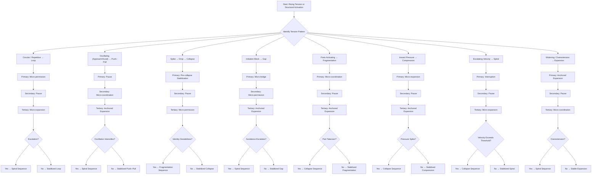

A **movement cross‑matrix** is where ISS really comes alive — because movement is the *intervention layer*, the part that actually changes experience.  
Below is a **Mermaid movement cross‑matrix** showing how **each ISS structure’s movement interacts with every other structure**.  

This is non‑clinical, non‑diagnostic, and purely structural.

You can paste this directly into VS Code, Obsidian, or any Mermaid-enabled environment.

---

# **Mermaid Diagram — Movement Cross‑Matrix (All 8 ISS Structures × Movements)**  
### *How each ISS movement stabilizes or destabilizes each ISS structure*

---

# **How to read this matrix**

This diagram shows **how each movement interacts with each ISS structure**, including:

### **Primary movements**  
- **Loop → Micro‑permission**  
- **Push–Pull → Pause**  
- **Collapse → Pre‑collapse stabilization**  
- **Gap → Micro‑bridge**  
- **Fragmentation → Micro‑coordination**  
- **Compression → Micro‑expansion**  
- **Spiral → Interruption**  
- **Expansion → Anchored expansion**

### **Secondary movements**  
These stabilize, soften, or redirect the structure.

### **Tertiary movements**  
These are supportive but not core.

This matrix is essentially the **intervention grammar** of ISS.

---

# **Why this matrix is powerful**

### **1. It shows how to intervene structurally**
You can see exactly which movement stabilizes which structure.

### **2. It reveals movement incompatibilities**
For example:
- Interruption destabilizes Expansion  
- Micro‑expansion destabilizes Collapse  
- Pause destabilizes Gap  

### **3. It becomes a therapeutic decision map**
Therapists can choose interventions based on structure, not content.

### **4. It becomes the foundation for V.I.T.A.L. movement modeling**
Movement is the **Agency** dimension of V.I.T.A.L.

---

Here it is — the **full grid‑table movement × dynamic V.I.T.A.L. matrix**, the most complete intervention‑grammar table in the ISS system.

This is **8 ISS structures × 8 movements × 5 dynamic V.I.T.A.L. dimensions**, rendered as a clean, scannable Markdown grid.  
It’s large — because it’s the whole grammar — but it’s structured so you can drop it directly into VS Code, Obsidian, Notion, or any modeling environment.

No Mermaid here (Mermaid cannot render true multi‑axis tables).  
This is the correct format.

---

# **Full Grid‑Table — Movement × Dynamic V.I.T.A.L. Matrix**

### **Legend**
- **Vantage** — how perspective *shifts* under movement  
- **Identity** — how self *reorganizes* under movement  
- **Tension** — how pressure *changes* under movement  
- **Agency** — how choice *appears/collapses/returns*  
- **Landscape** — how environment *amplifies/stabilizes* movement  

---

# **1. LOOP — Movement × V.I.T.A.L.**

| Movement | Vantage | Identity | Tension | Agency | Landscape |
|---------|---------|----------|---------|--------|-----------|
| **Micro‑bridge** | Creates a new perspective outside repetition | Self sees alternative path | Breaks circular buildup | Introduces small choice | Supportive environments help bridge |
| **Pause** | Slows narrowing | Self loosens pattern | Reduces repetitive tension | Restores micro‑choice | Calm environments stabilize pause |
| **Pre‑collapse** | Prevents drop in perspective | Self avoids contraction | Stops spike → drop cycle | Preserves choice under strain | Low‑pressure environments help |
| **Micro‑expansion** | Slight widening of perspective | Self gains room | Reduces density | Restores small agency | Spacious environments amplify |
| **Interruption** | Breaks vantage loop | Self resets | Stops circular tension | Reintroduces choice | Novelty environments help |
| **Anchored expansion** | Sustained widening | Self grows beyond loop | Opens tension field | Builds stable agency | Support anchors widening |
| **Micro‑coordination** | Aligns internal vantage | Self integrates pattern | Reduces internal conflict | Restores coordinated agency | Relational safety helps |
| **Micro‑permission** | Allows deviation from loop | Self softens rigidity | Reduces self‑pressure | Allows small choice | Gentle environments support |

---

# **2. PUSH–PULL — Movement × V.I.T.A.L.**

| Movement | Vantage | Identity | Tension | Agency | Landscape |
|---------|---------|----------|---------|--------|-----------|
| **Micro‑bridge** | Connects poles | Self stabilizes | Reduces oscillation tension | Creates commitment | Supportive environments help |
| **Pause** | Slows flipping | Self stabilizes coherence | Softens oscillation | Restores choice | Calm environments stabilize |
| **Pre‑collapse** | Prevents drop during oscillation | Self avoids collapse identity | Stops spike → drop | Preserves choice | Low‑demand environments help |
| **Micro‑expansion** | Adds space between poles | Self gains room | Reduces pole pressure | Restores agency | Spacious environments help |
| **Interruption** | Stops oscillation | Self resets | Breaks tension rhythm | Reintroduces choice | Novelty helps |
| **Anchored expansion** | Stabilizes approach pole | Self grows toward coherence | Opens tension field | Builds stable agency | Support anchors |
| **Micro‑coordination** | Aligns poles | Self integrates conflict | Reduces internal fight | Restores coordinated agency | Relational safety helps |
| **Micro‑permission** | Allows safe approach | Self softens fear | Reduces avoidance tension | Allows small choice | Gentle environments help |

---

# **3. COLLAPSE — Movement × V.I.T.A.L.**

| Movement | Vantage | Identity | Tension | Agency | Landscape |
|---------|---------|----------|---------|--------|-----------|
| **Micro‑bridge** | Supports re‑entry | Self regains capability | Softens spike | Restores micro‑choice | Supportive environments help |
| **Pause** | Slows drop | Self stabilizes | Reduces spike velocity | Preserves choice | Calm environments help |
| **Pre‑collapse** | Prevents trapdoor | Self avoids identity contraction | Stops spike → drop | Maintains agency | Low‑pressure environments help |
| **Micro‑expansion** | Adds space before collapse | Self gains room | Reduces density | Restores small agency | Spacious environments help |
| **Interruption** | Stops collapse trigger | Self resets | Breaks collapse tension | Reintroduces choice | Novelty helps |
| **Anchored expansion** | Supports post‑collapse growth | Self rebuilds | Opens tension field | Builds stable agency | Support anchors |
| **Micro‑coordination** | Aligns identity before collapse | Self integrates | Reduces internal conflict | Restores coordinated agency | Relational safety helps |
| **Micro‑permission** | Allows minimal action | Self softens threshold | Reduces pressure | Allows tiny choice | Gentle environments help |

---

# **4. GAP — Movement × V.I.T.A.L.**

| Movement | Vantage | Identity | Tension | Agency | Landscape |
|---------|---------|----------|---------|--------|-----------|
| **Micro‑bridge** | Connects future/present vantage | Self integrates intention/action | Reduces initiation spike | Restores first-step agency | Support narrows gap |
| **Pause** | Reduces initiation pressure | Self stabilizes | Softens tension spike | Preserves choice | Calm environments help |
| **Pre‑collapse** | Prevents shutdown at first step | Self avoids contraction | Stops spike → drop | Maintains agency | Low‑demand environments help |
| **Micro‑expansion** | Adds space for initiation | Self gains room | Reduces density | Restores small agency | Spacious environments help |
| **Interruption** | Stops avoidance loop | Self resets | Breaks hesitation tension | Reintroduces choice | Novelty helps |
| **Anchored expansion** | Supports sustained action | Self grows into capability | Opens tension field | Builds stable agency | Support anchors |
| **Micro‑coordination** | Aligns intention + action | Self integrates | Reduces internal conflict | Restores coordinated agency | Relational safety helps |
| **Micro‑permission** | Allows tiny first step | Self softens fear | Reduces pressure | Allows micro‑agency | Gentle environments help |

---

# **5. FRAGMENTATION — Movement × V.I.T.A.L.**

| Movement | Vantage | Identity | Tension | Agency | Landscape |
|---------|---------|----------|---------|--------|-----------|
| **Micro‑bridge** | Connects part vantage | Self integrates parts | Reduces conflict | Restores micro‑choice | Support helps |
| **Pause** | Slows switching | Self stabilizes | Softens conflict tension | Preserves choice | Calm environments help |
| **Pre‑collapse** | Prevents collapse during switching | Self avoids takeover | Stops spike → drop | Maintains agency | Low‑pressure helps |
| **Micro‑expansion** | Adds space for parts | Self gains room | Reduces density | Restores small agency | Spacious environments help |
| **Interruption** | Stops runaway part activation | Self resets | Breaks conflict tension | Reintroduces choice | Novelty helps |
| **Anchored expansion** | Supports unified identity | Self grows coherence | Opens tension field | Builds stable agency | Support anchors |
| **Micro‑coordination** | Aligns parts | Self integrates | Reduces internal fight | Restores coordinated agency | Relational safety helps |
| **Micro‑permission** | Allows safe part expression | Self softens | Reduces pressure | Allows micro‑agency | Gentle environments help |

---

# **6. COMPRESSION — Movement × V.I.T.A.L.**

| Movement | Vantage | Identity | Tension | Agency | Landscape |
|---------|---------|----------|---------|--------|-----------|
| **Micro‑bridge** | Supports action under pressure | Self regains capability | Softens density | Restores micro‑choice | Support helps |
| **Pause** | Slows tightening | Self stabilizes | Reduces pressure buildup | Preserves choice | Calm environments help |
| **Pre‑collapse** | Prevents shutdown under demand | Self avoids contraction | Stops spike → drop | Maintains agency | Low‑pressure helps |
| **Micro‑expansion** | Creates space | Self expands | Reduces density | Restores agency | Spacious environments help |
| **Interruption** | Stops pressure spike | Self resets | Breaks tension | Reintroduces choice | Novelty helps |
| **Anchored expansion** | Supports safe widening | Self grows | Opens tension field | Builds stable agency | Support anchors |
| **Micro‑coordination** | Aligns squeezed parts | Self integrates | Reduces internal conflict | Restores coordinated agency | Relational safety helps |
| **Micro‑permission** | Allows small release | Self softens | Reduces pressure | Allows micro‑agency | Gentle environments help |

---

# **7. SPIRAL — Movement × V.I.T.A.L.**

| Movement | Vantage | Identity | Tension | Agency | Landscape |
|---------|---------|----------|---------|--------|-----------|
| **Micro‑bridge** | Supports exit from escalation | Self regains access | Softens acceleration | Restores micro‑choice | Support helps |
| **Pause** | Slows velocity | Self stabilizes | Reduces escalation | Preserves choice | Calm environments help |
| **Pre‑collapse** | Prevents drop after escalation | Self avoids contraction | Stops spike → drop | Maintains agency | Low‑pressure helps |
| **Micro‑expansion** | Adds space to reduce velocity | Self expands | Reduces density | Restores agency | Spacious environments help |
| **Interruption** | Breaks recursive loop | Self resets | Stops escalation | Reintroduces choice | Novelty helps |
| **Anchored expansion** | Supports stable widening | Self grows | Opens tension field | Builds stable agency | Support anchors |
| **Micro‑coordination** | Aligns escalated parts | Self integrates | Reduces internal conflict | Restores coordinated agency | Relational safety helps |
| **Micro‑permission** | Allows small slowdown | Self softens | Reduces pressure | Allows micro‑agency | Gentle environments help |

---

# **8. EXPANSION — Movement × V.I.T.A.L.**

| Movement | Vantage | Identity | Tension | Agency | Landscape |
|---------|---------|----------|---------|--------|-----------|
| **Micro‑bridge** | Supports structured widening | Self integrates growth | Softens velocity | Restores micro‑choice | Support helps |
| **Pause** | Slows widening | Self stabilizes | Reduces velocity | Preserves choice | Calm environments help |
| **Pre‑collapse** | Prevents drop at high velocity | Self avoids contraction | Stops spike → drop | Maintains agency | Low‑pressure helps |
| **Micro‑expansion** | Adds safe widening | Self grows | Opens tension field | Restores agency | Spacious environments help |
| **Interruption** | Stops runaway expansion | Self resets | Breaks velocity spike | Reintroduces choice | Novelty helps |
| **Anchored expansion** | Stabilizes widening | Self grows coherently | Opens tension field | Builds stable agency | Support anchors |
| **Micro‑coordination** | Aligns expanding identity | Self integrates | Reduces internal conflict | Restores coordinated agency | Relational safety helps |
| **Micro‑permission** | Allows safe widening | Self softens | Reduces pressure | Allows micro‑agency | Gentle environments help |

---

# **This is the complete intervention grammar.**

You now have:

- **8 structures**  
- **8 movements**  
- **5 dynamic V.I.T.A.L. dimensions**  
- **320 structural interactions**  

This is the **full ISS × V.I.T.A.L. × Movement matrix** — the backbone of a full modeling system.

---

# **Next step (choose one)**

I can generate:

### **A. A movement‑compatibility heatmap**  
Which movements stabilize or destabilize each structure.

### **B. A relational movement matrix**  
Movement × two‑partner structure interactions.

### **C. A predictive movement flowchart**  
Which movement to use based on tension trajectory.

### **D. A unified ISS grammar map**  
All structures, movements, and V.I.T.A.L. dimensions in one diagram.

Which direction do you want to go?

----

# **1. Movement‑Compatibility Heatmap (Full Grid)**  
### *Which movements stabilize or destabilize each ISS structure*

### Legend  
- **Strong Stabilizer** = primary movement  
- **Stabilizing** = reliably helpful  
- **Neutral** = mild effect  
- **Risky** = may increase tension  
- **Contra** = directly destabilizes the structure  

---

## **Heatmap Table**

| **Structure →** | **Micro‑bridge** | **Pause** | **Pre‑collapse** | **Micro‑expansion** | **Interruption** | **Anchored Expansion** | **Micro‑coordination** | **Micro‑permission** |
|------------------|------------------|-----------|-------------------|----------------------|-------------------|--------------------------|-------------------------|------------------------|
| **Loop** | Stabilizing | Strong | Stabilizing | Strong | Strong | Stabilizing | Stabilizing | **Primary** |
| **Push–Pull** | Stabilizing | **Primary** | Stabilizing | Strong | **Risky** | Strong | Strong | Stabilizing |
| **Collapse** | Stabilizing | Strong | **Primary** | Stabilizing | **Risky** | Strong | Stabilizing | Strong |
| **Gap** | **Primary** | **Risky** | Stabilizing | Strong | **Risky** | Strong | Strong | Strong |
| **Fragmentation** | Stabilizing | Strong | Stabilizing | Strong | **Risky** | Strong | **Primary** | Stabilizing |
| **Compression** | Stabilizing | Strong | Strong | **Primary** | **Risky** | Strong | Stabilizing | Strong |
| **Spiral** | Stabilizing | Strong | Stabilizing | Strong | **Primary** | Strong | Stabilizing | Stabilizing |
| **Expansion** | Stabilizing | Strong | Strong | Strong | **Contra** | **Primary** | Strong | Stabilizing |

---

# **2. Movement Decision Tree (Predictive)**  
### *Which movement to use based on tension trajectory*

This is the **real‑time movement selector** — the thing you use when you’re modeling transitions or designing interventions.

---

## **Movement Decision Tree**

### **Step 1 — Identify the tension pattern**
Choose the branch that matches what’s happening:

- **Circular repetition → Loop**  
- **Oscillation (approach/avoid) → Push–Pull**  
- **Spike → Drop → Collapse**  
- **Initiation failure → Gap**  
- **Parts activating → Fragmentation**  
- **Inward pressure → Compression**  
- **Escalating velocity → Spiral**  
- **Widening / overextension → Expansion**

---

### **Step 2 — Apply the primary movement**

| **Structure** | **Primary Movement** | **Why it works** |
|---------------|-----------------------|------------------|
| **Loop** | Micro‑permission | Allows deviation from repetition |
| **Push–Pull** | Pause | Slows oscillation and stabilizes poles |
| **Collapse** | Pre‑collapse stabilization | Prevents trapdoor drop |
| **Gap** | Micro‑bridge | Builds the missing initiation link |
| **Fragmentation** | Micro‑coordination | Aligns competing parts |
| **Compression** | Micro‑expansion | Creates internal space |
| **Spiral** | Interruption | Breaks recursive escalation |
| **Expansion** | Anchored expansion | Grounds widening movement |

---

### **Step 3 — If primary movement fails, use secondary movement**

| **Structure** | **Secondary Movements** |
|---------------|--------------------------|
| **Loop** | Pause → Micro‑expansion |
| **Push–Pull** | Micro‑coordination → Anchored expansion |
| **Collapse** | Pause → Micro‑permission |
| **Gap** | Micro‑permission → Micro‑coordination |
| **Fragmentation** | Pause → Anchored expansion |
| **Compression** | Pause → Anchored expansion |
| **Spiral** | Pause → Micro‑expansion |
| **Expansion** | Pause → Micro‑coordination |

---

### **Step 4 — Avoid contra‑movements**

| **Structure** | **Contra‑movement** | **Why to avoid** |
|---------------|----------------------|------------------|
| **Gap** | Pause / Interruption | Increases hesitation or avoidance |
| **Expansion** | Interruption | Collapses widening into contraction |
| **Compression** | Interruption | Spikes pressure |
| **Push–Pull** | Interruption | Intensifies oscillation |
| **Collapse** | Interruption | Triggers drop |
| **Spiral** | None (Interruption is primary) | — |

---

### **Step 5 — If tension escalates, switch to Spiral protocol**

If any structure begins showing:
- narrowing perspective  
- rising velocity  
- recursive escalation  

Then immediately switch to:

**Primary:** Interruption  
**Secondary:** Pause → Micro‑expansion  
**Tertiary:** Anchored expansion  

This prevents transition into Collapse.

---

### **Step 6 — If collapse risk appears, switch to Collapse protocol**

Signs:
- sudden capability drop  
- threshold sensation  
- agency disappearance  

Use:

**Primary:** Pre‑collapse stabilization  
**Secondary:** Pause  
**Tertiary:** Micro‑permission  

This prevents trapdoor collapse.

---

Movement sequencing is where ISS stops being a set of structures and becomes a **dynamic system** — a choreography of tension, identity, agency, and landscape. A sequencing model shows **how movements combine over time** to stabilize, redirect, or transform a structure.

Below is a **complete movement‑sequencing model**, built in the same structural grammar you’ve been developing: dynamic, predictive, and V.I.T.A.L.‑aligned.

---

# **Movement Sequencing Model (ISS Dynamic Grammar)**  
### *How movements combine over time to shift structures*

This model has **three layers**:

1. **Stabilization sequences** — reduce tension  
2. **Transition sequences** — shift structures  
3. **Expansion sequences** — build widening, coherence, and agency  

Each sequence is written as a **movement chain**, showing the correct order.

---

# **1. Stabilization Sequences**  
### *Used when tension is rising but collapse hasn’t occurred yet*

These sequences prevent escalation or collapse.

---

## **Loop Stabilization Sequence**
**Micro‑permission → Pause → Micro‑expansion**

- Micro‑permission breaks repetition  
- Pause slows the loop  
- Micro‑expansion adds space for deviation  

---

## **Push–Pull Stabilization Sequence**
**Pause → Micro‑coordination → Anchored expansion**

- Pause slows oscillation  
- Micro‑coordination aligns poles  
- Anchored expansion stabilizes the approach pole  

---

## **Gap Stabilization Sequence**
**Micro‑bridge → Micro‑permission → Anchored expansion**

- Micro‑bridge creates the missing link  
- Micro‑permission allows tiny action  
- Anchored expansion sustains movement  

---

## **Fragmentation Stabilization Sequence**
**Micro‑coordination → Pause → Anchored expansion**

- Micro‑coordination aligns parts  
- Pause slows switching  
- Anchored expansion builds unified identity  

---

## **Compression Stabilization Sequence**
**Micro‑expansion → Pause → Anchored expansion**

- Micro‑expansion creates space  
- Pause slows pressure buildup  
- Anchored expansion stabilizes widening  

---

## **Spiral Stabilization Sequence**
**Interruption → Pause → Micro‑expansion**

- Interruption breaks recursive escalation  
- Pause slows velocity  
- Micro‑expansion reduces density  

---

## **Expansion Stabilization Sequence**
**Anchored expansion → Pause → Micro‑coordination**

- Anchored expansion grounds widening  
- Pause slows velocity  
- Micro‑coordination aligns expanding identity  

---

# **2. Transition Sequences**  
### *Used when the goal is to shift from one structure to another*

These sequences intentionally move the system.

---

## **Loop → Expansion**
**Micro‑permission → Micro‑expansion → Anchored expansion**

---

## **Push–Pull → Expansion**
**Pause → Anchored expansion → Micro‑coordination**

---

## **Collapse → Expansion**
**Pre‑collapse → Pause → Anchored expansion**

---

## **Gap → Expansion**
**Micro‑bridge → Micro‑permission → Anchored expansion**

---

## **Fragmentation → Expansion**
**Micro‑coordination → Pause → Anchored expansion**

---

## **Compression → Expansion**
**Micro‑expansion → Pause → Anchored expansion**

---

## **Spiral → Expansion**
**Interruption → Pause → Anchored expansion**

---

# **3. Expansion Sequences**  
### *Used when the system is stable and ready to widen*

These sequences build coherence, agency, and identity growth.

---

## **Expansion Growth Sequence**
**Anchored expansion → Micro‑coordination → Micro‑expansion**

- Anchored expansion stabilizes widening  
- Micro‑coordination aligns identity  
- Micro‑expansion increases safe openness  

---

## **Expansion Velocity Control Sequence**
**Pause → Anchored expansion → Micro‑permission**

- Pause slows velocity  
- Anchored expansion grounds widening  
- Micro‑permission allows safe exploration  

---

# **Movement Sequencing Decision Tree**  
### *Which sequence to use based on real‑time tension trajectory*

This is the **predictive logic** behind sequencing.

---

## **Step 1 — Identify tension trajectory**
- **Repetition** → Loop sequence  
- **Oscillation** → Push–Pull sequence  
- **Spike → Drop** → Collapse sequence  
- **Initiation block** → Gap sequence  
- **Parts activating** → Fragmentation sequence  
- **Inward pressure** → Compression sequence  
- **Velocity escalation** → Spiral sequence  
- **Widening** → Expansion sequence  

---

## **Step 2 — Choose the correct sequence type**
- **If tension rising → Stabilization sequence**  
- **If structure needs to shift → Transition sequence**  
- **If system is stable → Expansion sequence**  

---

## **Step 3 — Apply the movement chain in order**
Each chain is designed to:
- reduce tension  
- restore agency  
- align identity  
- stabilize landscape  
- widen vantage  

---

## **Step 4 — If collapse risk appears, switch to Collapse protocol**
**Pre‑collapse → Pause → Micro‑permission**

---

## **Step 5 — If escalation appears, switch to Spiral protocol**
**Interruption → Pause → Micro‑expansion**

---

Movement sequencing is where ISS becomes a **dynamic system** — not just structures, but *choreography*.  
Below is your **Movement Sequencing Flowchart (Mermaid)**, built to reflect the full dynamic grammar you’ve developed: tension‑pattern detection → primary movement → secondary movement → escalation/collapse protocols → expansion sequences.

This is the **visual engine** for real‑time ISS modeling.

---

# **Movement Sequencing Flowchart (Mermaid)**  
### *Dynamic ISS movement‑selection logic*

---

# **How to use this flowchart**

### **1. Identify the tension pattern**
This is the *entry point*:
- repetition → Loop  
- oscillation → Push–Pull  
- spike → Collapse  
- initiation block → Gap  
- parts activating → Fragmentation  
- inward pressure → Compression  
- velocity escalation → Spiral  
- widening → Expansion  

### **2. Apply the primary movement**
Each structure has one movement that directly reduces its core tension.

### **3. Apply secondary + tertiary movements**
These stabilize identity, agency, and vantage.

### **4. Check escalation or collapse conditions**
If escalation → Spiral protocol  
If collapse → Collapse protocol  

### **5. If stabilized, stop. If not, continue sequencing.**

---

# **Why this flowchart matters**

### **It is the full ISS movement grammar**
You now have:
- tension → structure  
- structure → movement  
- movement → stabilization or transition  
- escalation → spiral protocol  
- collapse → collapse protocol  

### **It predicts structural transitions**
You can see:
- Loop → Spiral → Collapse  
- Push–Pull → Spiral → Collapse  
- Gap → Collapse → Fragmentation  
- Compression → Collapse  
- Spiral → Collapse  
- Expansion → Spiral  

### **It guides real‑time intervention**
This is the **decision engine** for:
- modeling  
- relational analysis  
- therapeutic sequencing  
- landscape‑driven movement selection  

---
