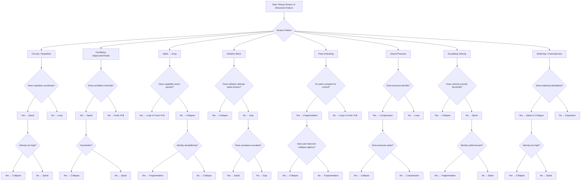

The **Predictive Transition Grid** — the ISS “weather map” that shows **which structures tend to transition into which others** under rising tension, environmental pressure, relational demand, or internal movement failure.

This is the **structural prediction engine** of ISS.

---

# **Predictive Transition Grid (ISS → ISS)**  
### *Which structures tend to shift into which others under tension*

### **Legend**
- **🟥 High‑probability transition** — very common under tension  
- **🟧 Moderate‑probability transition** — occurs under specific conditions  
- **🟨 Low‑probability transition** — possible but rare  
- **🟩 Stabilizing transition** — tension decreases, movement succeeds  
- **⬜ No meaningful transition** — structure tends not to shift this way  

---

# **Full Predictive Transition Grid**

| **From → To** | Loop | Push–Pull | Collapse | Gap | Fragmentation | Compression | Spiral | Expansion |
|---------------|------|-----------|----------|-----|----------------|-------------|--------|-----------|
| **Loop** | ⬜ | 🟧 oscillation emerges | 🟥 repetition → shutdown | 🟧 stuck → gap widens | 🟨 parts activate | 🟥 pressure builds | 🟥 escalation begins | 🟩 expansion if movement succeeds |
| **Push–Pull** | 🟧 oscillation → repetition | ⬜ | 🟥 oscillation → collapse | 🟥 oscillation blocks initiation | 🟧 parts activate | 🟥 oscillation compresses | 🟥 oscillation escalates | 🟩 expansion if approach stabilizes |
| **Collapse** | 🟨 collapse → loop | 🟨 collapse → oscillation | ⬜ | 🟥 collapse blocks initiation → gap | 🟥 collapse triggers parts | 🟥 collapse tightens pressure | 🟥 collapse → spiral | 🟩 expansion if recovery anchored |
| **Gap** | 🟧 gap → loop | 🟧 gap → oscillation | 🟥 gap → collapse | ⬜ | 🟧 gap → parts switching | 🟥 gap compresses | 🟥 gap escalates | 🟩 expansion if bridge succeeds |
| **Fragmentation** | 🟧 parts settle → loop | 🟧 parts oscillate | 🟥 part takeover → collapse | 🟥 parts block initiation → gap | ⬜ | 🟥 parts compress | 🟥 parts escalate | 🟩 expansion if parts integrate |
| **Compression** | 🟧 pressure → loop | 🟧 pressure → oscillation | 🟥 pressure → collapse | 🟥 pressure blocks initiation → gap | 🟥 pressure activates parts | ⬜ | 🟥 pressure escalates → spiral | 🟩 expansion if space created |
| **Spiral** | 🟧 spiral → loop | 🟧 spiral → oscillation | 🟥 spiral → collapse | 🟥 spiral blocks initiation → gap | 🟥 spiral activates parts | 🟥 spiral compresses | ⬜ | 🟩 expansion if interrupted + anchored |
| **Expansion** | 🟧 widening → loop | 🟧 widening → oscillation | 🟥 velocity → collapse | 🟥 widening → gap (overreach) | 🟧 widening → parts activation | 🟥 widening compresses (overload) | 🟥 widening escalates → spiral | ⬜ |

---

# **Interpretation: What the grid reveals**

## **1. The most common collapse pathways**
These are the “gravity wells” of ISS — structures that frequently collapse into others:

### **Collapse → Spiral**  
Collapse often leads to panic‑velocity escalation.

### **Compression → Collapse**  
Pressure → shutdown.

### **Gap → Collapse**  
Initiation failure → trapdoor.

### **Push–Pull → Collapse**  
Oscillation → overwhelm → drop.

### **Fragmentation → Collapse**  
Part takeover → shutdown.

### **Spiral → Collapse**  
Velocity → threshold → drop.

**Collapse is the most common endpoint** when tension spikes.

---

## **2. The most common escalation pathways**
These are the “upward tension ramps”:

### **Loop → Spiral**  
Repetition → acceleration.

### **Compression → Spiral**  
Pressure → velocity.

### **Push–Pull → Spiral**  
Oscillation → escalation.

### **Gap → Spiral**  
Blocked initiation → recursive escalation.

### **Fragmentation → Spiral**  
Parts escalate.

**Spiral is the most common escalation structure.**

---

## **3. The most common fragmentation pathways**
These are transitions where identity destabilizes:

### **Gap → Fragmentation**  
Intention/action split → parts activate.

### **Compression → Fragmentation**  
Pressure → part takeover.

### **Spiral → Fragmentation**  
Escalation → identity fracturing.

### **Push–Pull → Fragmentation**  
Oscillation → part conflict.

**Fragmentation is the most common identity‑destabilization structure.**

---

## **4. The most common stabilizing pathways**
These are transitions where tension decreases:

### **Loop → Expansion**  
If micro‑permission succeeds.

### **Push–Pull → Expansion**  
If approach pole stabilizes.

### **Gap → Expansion**  
If micro‑bridge succeeds.

### **Fragmentation → Expansion**  
If parts integrate.

### **Compression → Expansion**  
If micro‑expansion succeeds.

### **Spiral → Expansion**  
If interruption + anchoring succeed.

**Expansion is the universal stabilizer.**

---

## **5. The rare transitions**
These are low‑probability shifts:

- Loop → Fragmentation  
- Collapse → Loop  
- Expansion → Loop  
- Expansion → Fragmentation  

These require unusual conditions.

---

# **What this grid is for**

### **1. Predictive modeling**
You can forecast:
- what structure someone will enter next  
- how tension will evolve  
- where collapse will occur  
- which movement is needed to prevent transition  

### **2. Relational modeling**
You can predict:
- how one partner’s structure affects the other  
- how shared tension shifts both structures  
- how relational demand changes trajectories  

### **3. Therapeutic modeling**
You can identify:
- collapse points  
- escalation points  
- identity destabilization points  
- stabilizing pathways  

### **4. Movement selection**
You can choose:
- which movement prevents collapse  
- which movement prevents escalation  
- which movement prevents fragmentation  
- which movement supports expansion  

---

The **Predictive Transition Flowchart** — the structural “decision tree” that shows how experience tends to shift from one ISS structure to another as tension rises, agency collapses, or landscape destabilizes.

This is the **dynamic version**, meaning it models *movement*, *trajectory*, and *collapse timing*, not static states.

---

# **Predictive Transition Flowchart (Dynamic ISS Trajectories)**  
### *A real‑time decision tree for predicting structural transitions*

---

# **How to read this flowchart**

This is a **real‑time structural predictor**:

### **Step 1 — Identify the tension pattern**
- Circular → Loop  
- Oscillating → Push–Pull  
- Spike → Collapse  
- Initiation block → Gap  
- Parts activating → Fragmentation  
- Inward pressure → Compression  
- Escalating velocity → Spiral  
- Widening → Expansion  

### **Step 2 — Check the dynamic behavior**
Each branch asks:
- Does tension accelerate?  
- Does velocity exceed threshold?  
- Does identity destabilize?  
- Does agency collapse?  

### **Step 3 — Predict the next structure**
The flowchart shows:
- **Loop → Spiral → Collapse**  
- **Push–Pull → Spiral → Collapse**  
- **Gap → Collapse → Fragmentation**  
- **Compression → Collapse → Spiral**  
- **Fragmentation → Collapse**  
- **Spiral → Collapse → Fragmentation**  
- **Expansion → Spiral → Collapse**  

These are the **most common ISS transitions**.

---

# **Key predictive insights**

### **1. Collapse is the most common endpoint**
Most structures collapse when:
- tension spikes  
- velocity exceeds threshold  
- identity destabilizes  
- demand increases  

### **2. Spiral is the most common escalation**
Most structures escalate into Spiral when:
- repetition accelerates  
- oscillation intensifies  
- pressure densifies  
- avoidance loops escalate  

### **3. Fragmentation is the most common identity failure**
Structures transition into Fragmentation when:
- identity is pulled inward (Spiral)  
- parts activate under pressure (Compression)  
- intention/action split (Gap)  

### **4. Expansion is the universal stabilizer**
Structures transition into Expansion when:
- movement succeeds  
- support anchors widening  
- identity integrates  

---
