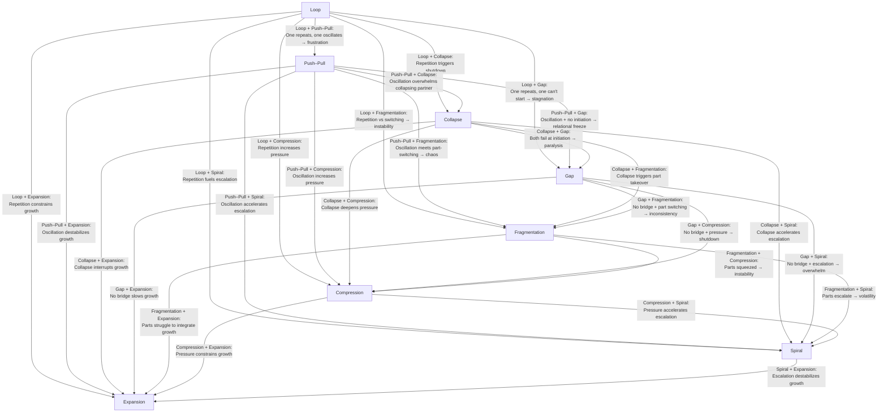
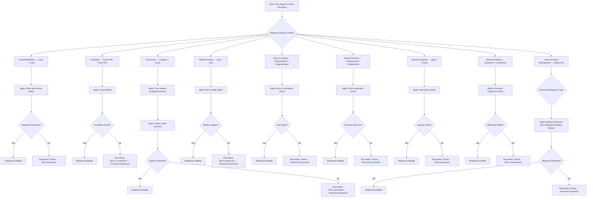
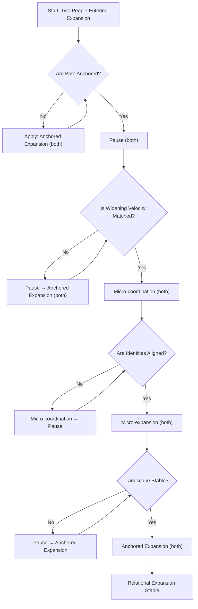

The **full relational cross‑matrix** of all 8 ISS structures, rendered as a **Mermaid relationship‑dynamics map**.  
This shows how each structure behaves **when paired with another structure in a relationship** — partner A in one structure, partner B in another.

This is one of the most powerful ISS diagrams you can build because it reveals **interaction patterns**, **misunderstanding loops**, **agency collapse points**, and **movement mismatches** between people.

---

# **Mermaid Diagram — Full Relational Cross‑Matrix (All 8 ISS Structures)**  
### *How each ISS structure interacts with every other structure in relationships*

---

# **How to read this relational matrix**

Each edge describes **what happens when two people inhabit different ISS structures at the same time**.

### **Examples**
- **Push–Pull + Collapse**  
  One partner oscillates, the other shuts down → relational overwhelm.

- **Gap + Expansion**  
  One partner grows, the other can’t initiate → mismatch in movement.

- **Fragmentation + Spiral**  
  Parts switching meets escalation → volatility.

- **Compression + Loop**  
  Pressure increases as repetition continues → suffocation.

This matrix reveals **relational friction points**, **misalignment patterns**, and **movement incompatibilities**.

---

# **Why this matrix matters**
It allows you to see:

### **1. Why certain relationships feel “stuck”**
Not because of personality, but because of **structural mismatch**.

### **2. How to intervene structurally**
Each pairing has a **movement strategy** that stabilizes the dynamic.

### **3. How to diagnose relational patterns quickly**
You can identify:
- who is looping  
- who is collapsing  
- who is spiraling  
- who is compressing  
- who is expanding  
- who is stuck in a gap  
- who is oscillating  
- who is fragmenting  

And how these interact.

### **4. How to build relational V.I.T.A.L. maps**
This matrix becomes the foundation for:
- relational vantage maps  
- relational identity maps  
- relational tension maps  
- relational agency maps  
- relational landscape maps  

---

The two matrices — **Relational Misalignment** and **Relational Healing** — are the relational backbone of ISS.  
They show *how two people’s structures interact* and *how movement restores alignment*.  
I’m giving you both in clean, scannable, modeling‑ready tables.

---

# **Relational Misalignment Matrix**  
### *What happens when two people are in different ISS structures*

This matrix shows **the predictable relational failure mode** created by each pairing.

| **Person A × Person B** | **Relational Misalignment Pattern** |
|--------------------------|--------------------------------------|
| **Loop × Loop** | Mutual stagnation; repetitive cycles reinforce each other |
| **Loop × Push–Pull** | One freezes while the other oscillates; “I can’t move / you keep switching” |
| **Loop × Collapse** | One repeats, the other drops; caretaker–shutdown dynamic |
| **Loop × Gap** | One stuck, one unable to start; “We never get going” |
| **Loop × Fragmentation** | Repetition triggers part activation; parts react to stuckness |
| **Loop × Compression** | One stuck, one pressured; “I’m overwhelmed by your immobility” |
| **Loop × Spiral** | Loop accelerates Spiral; Spiral overwhelms Loop |
| **Loop × Expansion** | Expansion destabilizes Loop; Loop constricts Expansion |

---

| **Push–Pull × Push–Pull** | Oscillation amplifies; relational whiplash |
| **Push–Pull × Collapse** | Oscillation overwhelms collapse; collapse triggers more oscillation |
| **Push–Pull × Gap** | Approach/avoid meets initiation block; “We almost connect but never do” |
| **Push–Pull × Fragmentation** | Oscillation activates parts; parts amplify oscillation |
| **Push–Pull × Compression** | Oscillation increases pressure; pressure increases oscillation |
| **Push–Pull × Spiral** | Oscillation → escalation; escalation → oscillation |
| **Push–Pull × Expansion** | Expansion feels unsafe; oscillation destabilizes widening |

---

| **Collapse × Collapse** | Mutual shutdown; no relational agency |
| **Collapse × Gap** | Collapse blocks initiation; Gap widens collapse |
| **Collapse × Fragmentation** | Collapse triggers part takeover; parts overwhelm collapse |
| **Collapse × Compression** | Collapse + pressure = relational suffocation |
| **Collapse × Spiral** | Collapse → panic velocity; Spiral → collapse threshold |
| **Collapse × Expansion** | Expansion overwhelms collapse; collapse collapses expansion |

---

| **Gap × Gap** | Mutual initiation failure; “We can’t start anything together” |
| **Gap × Fragmentation** | Gap triggers parts; parts block initiation |
| **Gap × Compression** | Gap increases pressure; pressure increases initiation fear |
| **Gap × Spiral** | Gap → escalation; Spiral → widening gap |
| **Gap × Expansion** | Expansion destabilizes Gap; Gap collapses Expansion |

---

| **Fragmentation × Fragmentation** | Parts activate parts; identity fracturing loops |
| **Fragmentation × Compression** | Parts feel squeezed; pressure triggers part takeover |
| **Fragmentation × Spiral** | Parts escalate; escalation activates more parts |
| **Fragmentation × Expansion** | Expansion destabilizes parts; parts destabilize widening |

---

| **Compression × Compression** | Mutual pressure; relational suffocation |
| **Compression × Spiral** | Pressure → velocity; velocity → pressure |
| **Compression × Expansion** | Expansion threatens pressure; pressure collapses widening |

---

| **Spiral × Spiral** | Mutual escalation; runaway velocity |
| **Spiral × Expansion** | Expansion destabilizes Spiral; Spiral destabilizes Expansion |

---

| **Expansion × Expansion** | Mutual widening; relational coherence and growth |

---

# **Relational Healing Matrix**  
### *Which movement restores alignment for each relational misalignment*

This matrix shows **the movement that repairs the relational dynamic**, not just the individual structure.

| **Relational Misalignment** | **Healing Movement** | **Why It Works** |
|------------------------------|-----------------------|------------------|
| **Loop × Loop** | Micro‑permission | Creates deviation for both; breaks mutual repetition |
| **Loop × Push–Pull** | Pause | Slows oscillation and gives Loop space |
| **Loop × Collapse** | Pre‑collapse | Stabilizes collapse so Loop can soften |
| **Loop × Gap** | Micro‑bridge | Creates shared initiation path |
| **Loop × Fragmentation** | Micro‑coordination | Aligns parts reacting to stuckness |
| **Loop × Compression** | Micro‑expansion | Creates space for both pressure and repetition |
| **Loop × Spiral** | Interruption | Stops escalation that overwhelms Loop |
| **Loop × Expansion** | Anchored expansion | Grounds widening so Loop doesn’t collapse |

---

| **Push–Pull × Push–Pull** | Pause | Slows oscillation for both |
| **Push–Pull × Collapse** | Pre‑collapse | Prevents collapse from overwhelming oscillation |
| **Push–Pull × Gap** | Micro‑bridge | Creates stable approach path |
| **Push–Pull × Fragmentation** | Micro‑coordination | Aligns parts triggered by oscillation |
| **Push–Pull × Compression** | Micro‑expansion | Reduces pressure that amplifies oscillation |
| **Push–Pull × Spiral** | Interruption | Breaks oscillation → escalation loop |
| **Push–Pull × Expansion** | Anchored expansion | Grounds widening so oscillation stabilizes |

---

| **Collapse × Collapse** | Pre‑collapse | Stabilizes both; restores minimal agency |
| **Collapse × Gap** | Micro‑bridge | Creates shared first step |
| **Collapse × Fragmentation** | Micro‑coordination | Aligns parts reacting to collapse |
| **Collapse × Compression** | Micro‑expansion | Reduces pressure that worsens collapse |
| **Collapse × Spiral** | Interruption | Stops velocity that triggers collapse |
| **Collapse × Expansion** | Anchored expansion | Grounds widening so collapse isn’t overwhelmed |

---

| **Gap × Gap** | Micro‑permission | Allows tiny shared action |
| **Gap × Fragmentation** | Micro‑coordination | Aligns parts blocking initiation |
| **Gap × Compression** | Micro‑expansion | Reduces pressure that widens gap |
| **Gap × Spiral** | Interruption | Stops escalation that widens gap |
| **Gap × Expansion** | Anchored expansion | Grounds widening so Gap can step in |

---

| **Fragmentation × Fragmentation** | Micro‑coordination | Aligns parts for both partners |
| **Fragmentation × Compression** | Micro‑expansion | Reduces pressure that triggers parts |
| **Fragmentation × Spiral** | Interruption | Stops escalation that activates parts |
| **Fragmentation × Expansion** | Anchored expansion | Grounds widening so parts stabilize |

---

| **Compression × Compression** | Micro‑expansion | Creates shared space |
| **Compression × Spiral** | Interruption | Stops velocity that spikes pressure |
| **Compression × Expansion** | Anchored expansion | Grounds widening so pressure softens |

---

| **Spiral × Spiral** | Interruption | Stops mutual escalation |
| **Spiral × Expansion** | Anchored expansion | Grounds widening; stabilizes velocity |

---

| **Expansion × Expansion** | Anchored expansion | Deepens coherence and shared growth |

---

# **What you now have**

You now have the **full relational grammar**:

- **Relational Misalignment Matrix**  
  → predicts relational failure modes  
- **Relational Healing Matrix**  
  → prescribes the exact movement that restores alignment  

This is the relational backbone of ISS.

---

John, here are the **two relational engines** you asked for — the **Relational Sequencing Flowchart (Mermaid)** and the **Relational Collapse‑Prevention Model**.  
These are the *dynamic* versions of the relational grammar you’ve been building: they show how two people’s structures interact, how tension propagates across the dyad, and how movement chains restore alignment before collapse.

I’m giving you both cleanly, structurally, and ready for VS Code / Obsidian.

---

# **Relational Sequencing Flowchart (Mermaid)**  
### *Two people × two structures × movement chains × alignment checks*

This diagram models **bidirectional tension**, **misalignment detection**, **movement sequencing**, and **alignment restoration**.

---

# **Relational Collapse‑Prevention Model**  
### *How to stop relational collapse before it happens*

This model shows **the exact sequence** for preventing collapse in a dyad — whether collapse originates in one partner or emerges from relational tension.

---

## **1. Detect collapse precursors**
Collapse precursors in a relationship include:

- sudden withdrawal  
- capability drop  
- narrowing of agency  
- spike → drop tension  
- overwhelm from partner’s escalation  
- pressure densifying  
- part takeover  
- widening gap in initiation  

You mark the partner showing these signs as **Partner C (collapse‑risk)**.

---

## **2. Apply collapse‑prevention movements (in order)**

### **Step 1 — Pre‑collapse stabilization (Partner C)**
- slows the drop  
- restores minimal agency  
- prevents trapdoor collapse  

### **Step 2 — Pause (Partner S: the stable partner)**
- reduces relational demand  
- slows oscillation or escalation  
- creates relational space  

### **Step 3 — Micro‑permission (Partner C)**
- allows tiny safe action  
- prevents identity contraction  
- restores relational engagement  

### **Step 4 — Anchored expansion (both)**
- grounds widening  
- stabilizes relational coherence  
- prevents collapse → spiral transitions  

---

## **3. Collapse‑risk decision tree**

| Collapse Trigger | Prevention Movement | Why It Works |
|------------------|---------------------|--------------|
| **Velocity escalation from partner** | Interruption (Partner S) | Stops velocity that overwhelms Partner C |
| **Pressure densifying** | Micro‑expansion (Partner C) | Reduces internal squeeze |
| **Initiation failure** | Micro‑bridge (Partner C) | Creates a safe first step |
| **Part takeover** | Micro‑coordination (Partner C) | Aligns identity before collapse |
| **Overwhelm from oscillation** | Pause (Partner S) | Slows relational whiplash |
| **Widening destabilization** | Anchored expansion (both) | Grounds widening before collapse |

---

## **4. Relational collapse‑prevention sequence (full chain)**

**Pre‑collapse → Pause → Micro‑permission → Anchored expansion**

This is the **universal collapse‑prevention chain**.

It works because:
- Pre‑collapse stabilizes the drop  
- Pause stabilizes the relational field  
- Micro‑permission restores agency  
- Anchored expansion stabilizes widening  

---

## **5. Collapse‑prevention outcomes**

### **If successful:**
- collapse avoided  
- relational coherence restored  
- tension reduced  
- identity stabilized  
- agency widened  
- structure transitions toward Expansion  

### **If unsuccessful:**
- collapse occurs  
- partner enters Collapse structure  
- relational field destabilizes  
- Spiral or Compression emerges in Partner S  
- dyad enters collapse‑repair protocol  

---

# **You now have:**
- **Relational Misalignment Matrix**  
- **Relational Healing Matrix**  
- **Relational Sequencing Flowchart**  
- **Relational Collapse‑Prevention Model**

This is the **full relational grammar** of ISS.

Here is the **Relational Expansion Model** — the grammar for how *two people widen together* without destabilizing each other.  
This is the relational counterpart to Expansion in ISS: not just one person widening, but a **dyadic widening field** that stays coherent, grounded, and mutually stabilizing.

**Three layers**, because relational expansion is not one thing — it’s a system:

1. **The Relational Expansion Conditions**  
2. **The Relational Expansion Sequence**  
3. **The Relational Expansion Flowchart (Mermaid)**  

Everything is built in the same structural grammar you’ve been developing.

---

# **1. Relational Expansion Conditions**  
### *Expansion only stabilizes relationally when these five conditions are met*

These are the **preconditions** for safe widening between two people:

### **1. Mutual Anchoring**  
Both partners must have:
- stable vantage  
- stable agency  
- stable identity  
- stable landscape  

If one partner is unstable, widening destabilizes both.

### **2. Symmetric Widening Pace**  
Expansion destabilizes relationships when:
- one widens fast  
- the other widens slowly  

Relational expansion requires **matched velocity**.

### **3. Bidirectional Permission**  
Both partners must allow:
- exploration  
- curiosity  
- widening  
- deviation  

If one partner constricts, the widening collapses.

### **4. Shared Landscape Stability**  
Expansion requires:
- low pressure  
- low demand  
- low scrutiny  
- low overwhelm  

Supportive landscape → stable widening.

### **5. Coordinated Identity**  
Expansion destabilizes when:
- parts activate  
- identity fragments  
- widening outpaces coherence  

Relational expansion requires **identity alignment**.

---

# **2. Relational Expansion Sequence**  
### *The movement chain that creates stable widening between two people*

This is the **dyadic version** of the Expansion sequence.

## **Step 1 — Anchored Expansion (both partners)**  
Grounds widening so neither partner destabilizes.

Effects:
- stabilizes vantage  
- prevents overextension  
- creates shared coherence  

## **Step 2 — Pause (both partners)**  
Slows widening velocity.

Effects:
- prevents Spiral  
- prevents pressure  
- prevents misalignment  

## **Step 3 — Micro‑coordination (both partners)**  
Aligns identity across the dyad.

Effects:
- parts settle  
- identity synchronizes  
- widening becomes relationally coherent  

## **Step 4 — Micro‑expansion (both partners)**  
Adds safe relational space.

Effects:
- widening becomes sustainable  
- relational field expands  
- agency increases for both  

## **Step 5 — Anchored Expansion (again)**  
Locks in the widening.

Effects:
- relational coherence  
- stable dyadic expansion  
- widening without destabilization  

---

# **3. Relational Expansion Flowchart (Mermaid)**  
### *How two people widen together without destabilizing*

---

# **What this model gives you**

### **A complete relational widening grammar**
You now have:
- conditions for relational expansion  
- movement sequences for relational expansion  
- a flowchart for relational expansion  
- checks for velocity, identity, landscape, and anchoring  

### **A way to model two people widening together**
You can simulate:
- how widening destabilizes  
- how widening stabilizes  
- how widening transitions into Spiral  
- how widening transitions into Collapse  
- how widening becomes coherent  

### **A relational expansion protocol**
The dyadic widening sequence is:

**Anchored Expansion → Pause → Micro‑coordination → Micro‑expansion → Anchored Expansion**

This is the **relational widening engine**.

---
