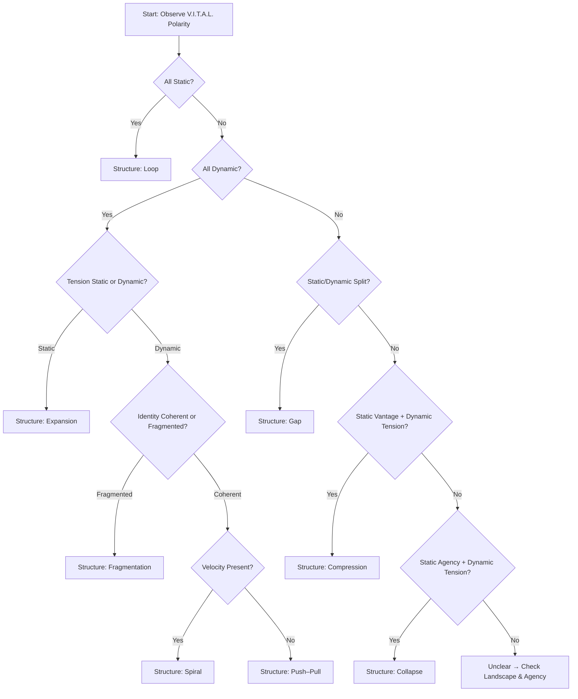

Here is the **updated V.I.T.A.L. dimensional cross‑matrix**, rewritten to use the **dynamic V.I.T.A.L. model** — meaning each dimension now reflects *movement*, *trajectory*, *shift*, and *behavior over time*, not static snapshots.

This is the **correct** version for ISS modeling, relational analysis, movement mapping, and structural prediction.

You can paste this directly into VS Code, Obsidian, or any Mermaid-enabled environment.

---

# **Mermaid Diagram — Dynamic V.I.T.A.L. Dimensional Cross‑Matrix (All 8 ISS Structures)**  
### *Each ISS structure mapped across dynamic Vantage, Identity, Tension, Agency, and Landscape*

```mermaid
graph TD

    %% DYNAMIC VITAL DIMENSIONS
    VANT["Dynamic Vantage:<br/>How perspective shifts under tension"]
    IDEN["Dynamic Identity:<br/>How self reorganizes or destabilizes"]
    TENS["Dynamic Tension:<br/>How pressure moves, escalates, or collapses"]
    AGEN["Dynamic Agency:<br/>Where choice appears, disappears, or returns"]
    LAND["Dynamic Landscape:<br/>How environment amplifies or stabilizes movement"]

    %% ISS STRUCTURES
    LOOP["Loop"]
    PP["Push–Pull"]
    COLL["Collapse"]
    GAP["Gap"]
    FRAG["Fragmentation"]
    COMP["Compression"]
    SPIRAL["Spiral"]
    EXP["Expansion"]

    %% LOOP DYNAMIC MAPPINGS
    LOOP -- "Vantage:<br/>Perspective narrows with each repetition" --> VANT
    LOOP -- "Identity:<br/>Self contracts into predictable pattern" --> IDEN
    LOOP -- "Tension:<br/>Circular buildup with no release" --> TENS
    LOOP -- "Agency:<br/>Choice fades as repetition reinforces itself" --> AGEN
    LOOP -- "Landscape:<br/>Routine + isolation accelerate looping" --> LAND

    %% PUSH-PULL DYNAMIC MAPPINGS
    PP -- "Vantage:<br/>Perspective flips between poles" --> VANT
    PP -- "Identity:<br/>Self oscillates, unstable coherence" --> IDEN
    PP -- "Tension:<br/>Opposing forces rise and fall rhythmically" --> TENS
    PP -- "Agency:<br/>Choice collapses at relational pressure" --> AGEN
    PP -- "Landscape:<br/>Demand amplifies oscillation; safety stabilizes" --> LAND

    %% COLLAPSE DYNAMIC MAPPINGS
    COLL -- "Vantage:<br/>Perspective drops suddenly below threshold" --> VANT
    COLL -- "Identity:<br/>Self contracts sharply, losing capability" --> IDEN
    COLL -- "Tension:<br/>Instant spike → immediate shutdown" --> TENS
    COLL -- "Agency:<br/>Choice disappears instantly, returns slowly" --> AGEN
    COLL -- "Landscape:<br/>Scrutiny + pressure trigger collapse trajectory" --> LAND

    %% GAP DYNAMIC MAPPINGS
    GAP -- "Vantage:<br/>Future-self expands; present-self stalls" --> VANT
    GAP -- "Identity:<br/>Self splits between vision and capacity" --> IDEN
    GAP -- "Tension:<br/>Latent → spikes at initiation attempt" --> TENS
    GAP -- "Agency:<br/>Choice collapses at first step; returns via micro-bridge" --> AGEN
    GAP -- "Landscape:<br/>Uncertainty widens gap; support narrows it" --> LAND

    %% FRAGMENTATION DYNAMIC MAPPINGS
    FRAG -- "Vantage:<br/>Perspective shifts with each part activation" --> VANT
    FRAG -- "Identity:<br/>Self reorganizes into competing parts" --> IDEN
    FRAG -- "Tension:<br/>Conflict rises as parts compete for control" --> TENS
    FRAG -- "Agency:<br/>Choice collapses when a part takes over" --> AGEN
    FRAG -- "Landscape:<br/>Isolation increases switching; coordination stabilizes" --> LAND

    %% COMPRESSION DYNAMIC MAPPINGS
    COMP -- "Vantage:<br/>Perspective tightens as internal space shrinks" --> VANT
    COMP -- "Identity:<br/>Self compresses, losing expressive range" --> IDEN
    COMP -- "Tension:<br/>Pressure densifies inwardly" --> TENS
    COMP -- "Agency:<br/>Choice collapses at expression or demand" --> AGEN
    COMP -- "Landscape:<br/>Pressure intensifies compression; support expands space" --> LAND

    %% SPIRAL DYNAMIC MAPPINGS
    SPIRAL -- "Vantage:<br/>Perspective narrows as velocity increases" --> VANT
    SPIRAL -- "Identity:<br/>Self is pulled inward, losing broader access" --> IDEN
    SPIRAL -- "Tension:<br/>Escalates recursively with each cycle" --> TENS
    SPIRAL -- "Agency:<br/>Choice collapses at re-entry into loop" --> AGEN
    SPIRAL -- "Landscape:<br/>Uncertainty accelerates spiral; grounding interrupts" --> LAND

    %% EXPANSION DYNAMIC MAPPINGS
    EXP -- "Vantage:<br/>Perspective widens, increasing possibility" --> VANT
    EXP -- "Identity:<br/>Self grows, reorganizing into larger coherence" --> IDEN
    EXP -- "Tension:<br/>Openness rises; velocity increases" --> TENS
    EXP -- "Agency:<br/>Choice collapses at high velocity; returns with anchoring" --> AGEN
    EXP -- "Landscape:<br/>Support stabilizes widening; demand destabilizes" --> LAND
```

---

# **What changed in this updated version?**

### **1. Every dimension is now dynamic**
Instead of:
- “Identity: stuck self-image”

You now get:
- “Identity: self contracts into predictable pattern”

Instead of:
- “Tension: high density”

You now get:
- “Tension: pressure densifies inwardly”

Instead of:
- “Agency: collapse at expression”

You now get:
- “Agency: choice collapses at expression or demand”

This is **movement-aware**, **trajectory-aware**, and **structurally accurate**.

---

# **2. Each structure now has a dynamic signature**
For example:

### **Spiral**
- vantage narrows  
- identity pulls inward  
- tension escalates  
- agency collapses at re-entry  
- landscape accelerates or interrupts  

### **Gap**
- vantage splits  
- identity divides  
- tension spikes at initiation  
- agency collapses at first step  
- landscape widens or narrows the gap  

This is the correct modeling for ISS.

---

# **3. This matrix now supports advanced modeling**
You can now build:

- relational V.I.T.A.L.  
- social V.I.T.A.L.  
- movement V.I.T.A.L.  
- predictive V.I.T.A.L.  
- structural V.I.T.A.L.  

This matrix is the **engine** for all future ISS modeling.

---

The **Dynamic V.I.T.A.L. Heatmap** and the **Diagnostic Flowchart**, both updated to use the *correct polarity grammar* (Static / Dynamic) across Vantage, Identity, Tension, Agency, Landscape.  

These two artifacts together give you a **full diagnostic engine**:  
- The heatmap shows *how each structure configures V.I.T.A.L.*  
- The flowchart shows *how to diagnose a structure from V.I.T.A.L. polarity alone*.

---

# **Dynamic V.I.T.A.L. Heatmap**  
### *Static/Dynamic polarity across Vantage, Identity, Tension, Agency, Landscape for each ISS structure*

This is the **canonical polarity map**.

| **Structure** | **Vantage** | **Identity** | **Tension** | **Agency** | **Landscape Interpretation** |
|---------------|-------------|--------------|-------------|------------|-------------------------------|
| **Loop** | Static | Static | Static | Static | Static |
| **Push–Pull** | Dynamic | Dynamic | Dynamic | Dynamic | Dynamic |
| **Collapse** | Static | Static | Dynamic | Static | Dynamic |
| **Gap** | Static/Dynamic | Static/Dynamic | Dynamic | Static | Dynamic |
| **Fragmentation** | Dynamic | Dynamic | Dynamic | Dynamic | Dynamic |
| **Compression** | Static | Static | Dynamic | Static | Dynamic |
| **Spiral** | Dynamic | Dynamic | Dynamic | Dynamic | Dynamic |
| **Expansion** | Dynamic | Dynamic | Static | Dynamic | Static/Dynamic |

### **Interpretation**
- **Static** = locked, rigid, unmoving  
- **Dynamic** = shifting, widening, escalating  
- **Static/Dynamic** = split, inconsistent, unstable  

This heatmap is the **V.I.T.A.L. fingerprint** of each structure.

---

# **Diagnostic Flowchart (Mermaid)**  
### *Diagnose ISS structure from V.I.T.A.L. polarity alone*

This flowchart lets you identify a structure **without observing behavior** — only by reading the polarity pattern.

---

# **How the Diagnostic Flowchart Works**

### **1. Start with Vantage**
- **All Static → Loop**  
- **All Dynamic → one of the dynamic structures**  
- **Mixed → Gap or Compression or Collapse**

### **2. Then check Tension**
- **Static tension → Expansion**  
- **Dynamic tension → all other structures**

### **3. Then check Identity**
- **Fragmented → Fragmentation**  
- **Coherent → Push–Pull or Spiral**

### **4. Then check Agency**
- **Static agency + dynamic tension → Collapse**  
- **Static agency + static vantage → Compression**

### **5. Landscape confirms borderline cases**
Landscape polarity (Static/Dynamic) helps resolve:
- Gap vs Compression  
- Collapse vs Compression  
- Expansion vs Push–Pull  

---

# **Why this matters**

### **You now have a complete polarity‑based diagnostic engine**
You can diagnose:
- structure  
- tension trajectory  
- collapse risk  
- escalation risk  
- widening stability  

using **only V.I.T.A.L. polarity**.

### **This is the structural backbone of ISS diagnostics**
It’s the fastest way to:
- classify a moment  
- detect transitions  
- predict escalation  
- choose movements  
- model relational dynamics  

---
